# Terrenos en Venta en Córdoba

**Reporte de mercado** · 2026-02-28 23:18 · Fuente: [zonaprop.com.ar](https://www.zonaprop.com.ar/terrenos-venta-cordoba.html)

---

## Resumen del Mercado

- **Publicaciones analizadas:** 147
- **Rango de precios (USD):** $5,000 – $4,111,120
- **Precio promedio:** $165,738
- **Precio mediano:** $64,500
- **Superficie:** 200 m² – 370,000 m²
- **Superficie promedio:** 4,576 m²
- **Precio/m² promedio (USD):** $135.16
- **Precio/m² mediano (USD):** $130.00

## Distribución de Precios

```chart
{"type": "bar", "data": {"labels": ["< 25K", "25K–50K", "50K–75K", "75K–100K", "100K–150K", "150K–250K", "250K–500K", "500K+"], "datasets": [{"label": "Cantidad de terrenos", "data": [12, 41, 35, 16, 18, 10, 9, 5], "backgroundColor": "rgba(2, 116, 182, 0.75)", "borderColor": "rgba(2, 116, 182, 1)", "borderWidth": 1}]}, "options": {"plugins": {"title": {"display": true, "text": "Distribución de Precios (USD)"}}, "scales": {"y": {"beginAtZero": true, "title": {"display": true, "text": "Cantidad"}}, "x": {"title": {"display": true, "text": "Rango de precio"}}}}}
```

```chart
{"type": "bar", "data": {"labels": ["Santa María de Punilla", "Colonia Caroya", "Barrio de Campo El Sereno", "Los Cocos", "La Granja", "Ascochinga", "Monte Cristo", "Alta Gracia", "San Javier", "Villa Parque Siquiman", "San Antonio de Arredondo", "La Falda", "Río Ceballos", "Carlos Paz Golf Country C", "Unquillo", "Río Segundo", "Villa del Lago", "El Potrerillo de Larreta", "Santa María", "Villa Allende Golf"], "datasets": [{"label": "Precio/m² promedio (USD)", "data": [1.27, 3.21, 10.81, 12.5, 15.14, 15.25, 15.53, 16.99, 18.3, 20.83, 23.36, 31.09, 39.87, 42.62, 44.76, 45.3, 47.98, 49.36, 50.22, 53.25], "backgroundColor": "rgba(34, 139, 34, 0.65)", "borderColor": "rgba(34, 139, 34, 1)", "borderWidth": 1}]}, "options": {"indexAxis": "y", "plugins": {"title": {"display": true, "text": "Precio/m² por Zona (más económicas primero)"}}, "scales": {"x": {"beginAtZero": true, "title": {"display": true, "text": "USD/m²"}}}}}
```

```chart
{"type": "scatter", "data": {"datasets": [{"label": "Superficie vs Precio", "data": [{"x": 800.0, "y": 40000}, {"x": 360.0, "y": 65000}, {"x": 1440.0, "y": 30000}, {"x": 560.0, "y": 85000}, {"x": 322.0, "y": 5000}, {"x": 360.0, "y": 62100}, {"x": 1886.0, "y": 450000}, {"x": 360.0, "y": 48500}, {"x": 1460.0, "y": 257000}, {"x": 360.0, "y": 65000}, {"x": 1907.0, "y": 137000}, {"x": 451.0, "y": 74000}, {"x": 4179.0, "y": 70999}, {"x": 600.0, "y": 36000}, {"x": 630.0, "y": 120000}, {"x": 6000.0, "y": 249000}, {"x": 250.0, "y": 36500}, {"x": 680.0, "y": 26500}, {"x": 250.0, "y": 50000}, {"x": 1050.0, "y": 180000}, {"x": 364.0, "y": 118000}, {"x": 2716.0, "y": 190000}, {"x": 1594.0, "y": 156000}, {"x": 460.0, "y": 85000}, {"x": 784.0, "y": 34500}, {"x": 453.0, "y": 64000}, {"x": 387.0, "y": 58000}, {"x": 254.0, "y": 70000}, {"x": 3763.0, "y": 285000}, {"x": 414.0, "y": 69000}, {"x": 618.0, "y": 85000}, {"x": 250.0, "y": 43000}, {"x": 600.0, "y": 130000}, {"x": 525.0, "y": 74000}, {"x": 294.0, "y": 39000}, {"x": 1181.0, "y": 45000}, {"x": 1000.0, "y": 14000}, {"x": 5000.0, "y": 50400}, {"x": 827.0, "y": 42000}, {"x": 256.0, "y": 320000}, {"x": 1627.0, "y": 125000}, {"x": 2135.0, "y": 95000}, {"x": 360.0, "y": 44000}, {"x": 476.0, "y": 34000}, {"x": 393.0, "y": 72500}, {"x": 4338.0, "y": 74000}, {"x": 1550.0, "y": 58900}, {"x": 1727.0, "y": 50000}, {"x": 322.0, "y": 5000}, {"x": 200.0, "y": 75000}, {"x": 1000.0, "y": 73000}, {"x": 1361.0, "y": 58000}, {"x": 360.0, "y": 60000}, {"x": 1500.0, "y": 260000}, {"x": 1907.0, "y": 137000}, {"x": 749.0, "y": 17500}, {"x": 450.0, "y": 75000}, {"x": 4380.0, "y": 29000}, {"x": 490.0, "y": 28000}, {"x": 450.0, "y": 23000}, {"x": 478.0, "y": 49900}, {"x": 685.0, "y": 44000}, {"x": 650.0, "y": 80000}, {"x": 260.0, "y": 36000}, {"x": 261.0, "y": 46000}, {"x": 450.0, "y": 25500}, {"x": 350.0, "y": 59000}, {"x": 1000.0, "y": 149400}, {"x": 360.0, "y": 95000}, {"x": 2530.0, "y": 49400}, {"x": 2000.0, "y": 25000}, {"x": 810.0, "y": 60000}, {"x": 360.0, "y": 88000}, {"x": 1061.0, "y": 90000}, {"x": 364.0, "y": 118000}, {"x": 1050.0, "y": 15900}, {"x": 1938.0, "y": 100000}, {"x": 1063.0, "y": 61000}, {"x": 360.0, "y": 62000}, {"x": 305.0, "y": 85000}, {"x": 262.0, "y": 32500}, {"x": 1192.0, "y": 54000}, {"x": 265.0, "y": 55000}, {"x": 500.0, "y": 38000}, {"x": 270.0, "y": 16500}, {"x": 2348.0, "y": 73000}, {"x": 1200.0, "y": 90000}, {"x": 1506.0, "y": 350000}, {"x": 420.0, "y": 105000}, {"x": 350.0, "y": 32000}, {"x": 635.0, "y": 300000}, {"x": 250.0, "y": 38000}, {"x": 1868.0, "y": 20200}, {"x": 350.0, "y": 31500}, {"x": 6000.0, "y": 130000}, {"x": 1313.0, "y": 95000}, {"x": 300.0, "y": 44000}, {"x": 2330.0, "y": 115000}, {"x": 287.0, "y": 42000}, {"x": 730.0, "y": 39000}, {"x": 530.0, "y": 22900}, {"x": 300.0, "y": 65000}, {"x": 1097.0, "y": 175000}, {"x": 360.0, "y": 59000}, {"x": 2100.0, "y": 45000}, {"x": 275.0, "y": 34000}, {"x": 272.0, "y": 43500}, {"x": 350.0, "y": 55000}, {"x": 10350.0, "y": 145000}, {"x": 300.0, "y": 22000}, {"x": 1622.0, "y": 298000}, {"x": 1500.0, "y": 120000}, {"x": 1050.0, "y": 141000}, {"x": 800.0, "y": 235000}, {"x": 1925.0, "y": 42000}, {"x": 250.0, "y": 39500}, {"x": 1129.0, "y": 220000}, {"x": 250.0, "y": 34500}, {"x": 360.0, "y": 79000}, {"x": 303.0, "y": 70000}, {"x": 358.0, "y": 200000}, {"x": 360.0, "y": 62000}, {"x": 410.0, "y": 132000}, {"x": 630.0, "y": 70000}, {"x": 250.0, "y": 35000}, {"x": 250.0, "y": 51500}, {"x": 250.0, "y": 55000}, {"x": 380.0, "y": 80000}, {"x": 360.0, "y": 79000}, {"x": 360.0, "y": 26000}, {"x": 250.0, "y": 24000}, {"x": 1212.0, "y": 159000}, {"x": 360.0, "y": 34850}, {"x": 1051.0, "y": 72620}, {"x": 360.0, "y": 115000}, {"x": 338.0, "y": 47000}, {"x": 1500.0, "y": 130000}, {"x": 300.0, "y": 49000}, {"x": 502.0, "y": 10000}], "backgroundColor": "rgba(2, 116, 182, 0.5)", "pointRadius": 5}]}, "options": {"plugins": {"title": {"display": true, "text": "Relación Superficie vs Precio (< 500K USD, < 15.000 m²)"}}, "scales": {"x": {"title": {"display": true, "text": "Superficie (m²)"}}, "y": {"title": {"display": true, "text": "Precio (USD)"}, "beginAtZero": true}}}}
```

---

## Rankings

### Mejor Relación Calidad-Precio

> Score compuesto: 65% precio/m² + 35% tamaño óptimo (~2.000 m²)

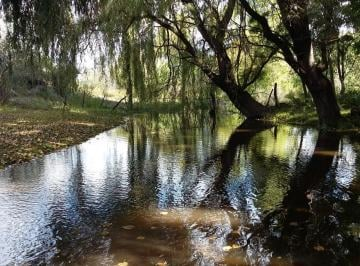

**#1** — **Santa María de Punilla, Córdoba**

- **Precio:** USD 470.000
- **Superficie:** 370,000 m²
- **Precio/m²:** USD 1.27/m²
- LopezBaena comercializa una muy buena oportunidad de emprendimiento! Se trata de 34 hectáreas declaradas en la localidad
- LopezBaena comercializa una MUY BUENA OPORTUNIDAD DE EMPRENDIMIENTO!

Se trata de 34 hectáreas declaradas en la localidad de Cabalango, a 3Km de la ruta de Tanti - Cabalango se encuentran estas tierra
- [Ver publicación](https://www.zonaprop.com.ar/propiedades/clasificado/vecltrin-vendo-terreno-en-cabalango-con-2-arroyos-37-58220315.html?n_src=Listado&n_pg=1&n_pos=22)


**#2** — **Colonia Caroya, Córdoba**

- **Precio:** USD 170.000
- **Superficie:** 53,000 m²
- **Precio/m²:** USD 3.21/m²
- Grupo norte vende. ¡gran oportunidad! Gran lote de 53. 000 M² ideal para siembra O desarrollo productivo. Ubicado en un 
- GRUPO NORTE VENDE

¡GRAN OPORTUNIDAD!

GRAN LOTE DE 53.000 M² IDEAL PARA SIEMBRA O DESARROLLO PRODUCTIVO.

UBICADO EN UN ENTORNO NATURAL PRIVILEGIADO, CON EXCELENTE ACCESIBILIDAD Y SERVICIOS DISPONIBL
- [Ver publicación](https://www.zonaprop.com.ar/propiedades/clasificado/vecltrin-venta-campo-de-5-3-ha-ideal-para-producir-56901548.html?n_src=Listado&n_pg=2&n_pos=16)

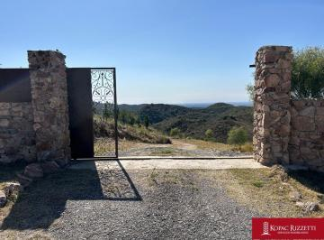

**#3** — **Río Ceballos, Córdoba**

- **Precio:** USD 29.000
- **Superficie:** 4,380 m²
- **Precio/m²:** USD 6.62/m²
- Potrero del alto - chacras de montaña. venta lotes desde 4000 M2. Camino del cuadrado. Rio ceballos. Córdoba. - Ubicació
- [Ver publicación](https://www.zonaprop.com.ar/propiedades/clasificado/vecltrin-potrero-del-alto-camino-del-cuadrado-venta-lotes-54163368.html?n_src=Listado&n_pills=Encargado&n_pg=3&n_pos=5)


**#4** — **Ascochinga, Córdoba**

- **Precio:** USD 50.400
- **Superficie:** 5,000 m²
- **Precio/m²:** USD 10.08/m²
- Lotes de 5. 000 m² en El Buen Aire Viví rodeado de naturaleza. En un rincón único entre Ascochinga y la Estancia Jesuíti
- Lotes de 5.000 m² en El Buen Aire Viví rodeado de naturaleza

En un rincón único entre Ascochinga y la Estancia Jesuítica Santa Catalina, se encuentra El Buen Aire, un barrio con seguridad en un entor
- [Ver publicación](https://www.zonaprop.com.ar/propiedades/clasificado/vecltrin-terrenos-en-venta-de-5000-m-sup2--en-el-buen-aire-57412066.html?n_src=Listado&n_pills=Encargado&n_pg=2&n_pos=13)


**#5** — **Los Cocos, Córdoba**

- **Precio:** USD 25.000
- **Superficie:** 2,000 m²
- **Precio/m²:** USD 12.50/m²
- Excelente oportunidad, ultimos 2 lotes! se vende los siguentes lotescon escrituraprecio en dolares. financiación hasta e
- [Ver publicación](https://www.zonaprop.com.ar/propiedades/clasificado/vecltrin-ultimos-2-lotes-!-los-cocos-b-jardin-financiacion-58220249.html?n_src=Listado&n_pg=3&n_pos=19)

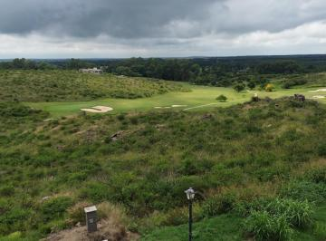

**#6** — **Ascochinga, Córdoba**

- **Precio:** USD 145.000
- **Superficie:** 10,350 m²
- **Precio/m²:** USD 14.01/m²
- Lote en Barrio de Campo, Estancia La Paz, Ascochinga. 10. 350m² Estancia La Paz es un hotel. Un barrio de campo. Una can
- [Ver publicación](https://www.zonaprop.com.ar/propiedades/clasificado/vecltrin-terreno-en-venta-frente-golf-estancia-la-paz-58395129.html?n_src=Listado&n_pg=4&n_pos=30)


**#7** — **Alta Gracia, Córdoba**

- **Precio:** USD 70.999
- **Superficie:** 4,179 m²
- **Precio/m²:** USD 16.99/m²
- Lote en venta en Campos del Virrey. Si buscás un lugar único para construir tu casa, este lote es para vos. Tiene una su
- Lote en venta en Campos del Virrey.
Si buscás un lugar único para construir tu casa, este lote es para vos.
Tiene una superficie amplía, rodeado de árboles y vegetación cuidadosamente diseñada por pai
- [Ver publicación](https://www.zonaprop.com.ar/propiedades/clasificado/vecltrin-terreno-en-venta-campos-del-virrey-58369841.html?n_src=Listado&n_pg=1&n_pos=17)

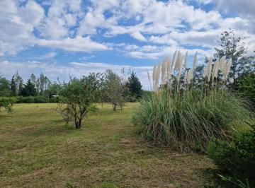

**#8** — **San Javier, Córdoba**

- **Precio:** USD 74.000
- **Superficie:** 4,338 m²
- **Precio/m²:** USD 17.06/m²
- Un Terrenazo, Hermoso en el corazon de Barrio San Onofre!! Con superficie plana, agradables vistas a las Sierras Grandes
- Un Terrenazo, Hermoso en el corazon de Barrio San Onofre!!

Con superficie plana, agradables vistas a las Sierras Grandes y con vegetación que le dan armonía y belleza.

Todo con cerco perimetral.

Id
- [Ver publicación](https://www.zonaprop.com.ar/propiedades/clasificado/vecltrin-terreno-en-venta-en-barrio-san-onofre-san-javier-58226843.html?n_src=Listado&n_pills=Apto+cr%C3%A9dito&n_pg=2&n_pos=22)

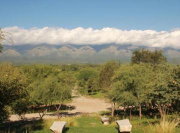

**#9** — **San Javier, Córdoba**

- **Precio:** USD 49.400
- **Superficie:** 2,530 m²
- **Precio/m²:** USD 19.53/m²
- Emplazada sobre Ruta Provincial 14, Km. 133, 5 | Paraje: Camino a San Javier - Valle de Traslasierra, Provincia de Córdo
- [Ver publicación](https://www.zonaprop.com.ar/propiedades/clasificado/vecltrin-venta-de-lote-terreno-en-la-matilde-comarca-57844164.html?n_src=Listado&n_pills=Pileta&n_pg=3&n_pos=18)


**#10** — **Ascochinga, Córdoba**

- **Precio:** USD 130.000
- **Superficie:** 6,000 m²
- **Precio/m²:** USD 21.67/m²
- Lote 114 Mza 20 Sierras - Estancia La Paz - Ascochinga CórdobaEstancia La Paz - Naturaleza, Historia y Estilo de Vida en
- [Ver publicación](https://www.zonaprop.com.ar/propiedades/clasificado/vecltrin-venta-de-lote-en-estancia-la-paz-ascochinga-58247170.html?n_src=Listado&n_pills=Encargado&n_pg=4&n_pos=15)

---

### Más Económicos por m²


**#1** — **Santa María de Punilla, Córdoba**

- **Precio:** USD 470.000
- **Superficie:** 370,000 m²
- **Precio/m²:** USD 1.27/m²
- LopezBaena comercializa una muy buena oportunidad de emprendimiento! Se trata de 34 hectáreas declaradas en la localidad
- LopezBaena comercializa una MUY BUENA OPORTUNIDAD DE EMPRENDIMIENTO!

Se trata de 34 hectáreas declaradas en la localidad de Cabalango, a 3Km de la ruta de Tanti - Cabalango se encuentran estas tierra
- [Ver publicación](https://www.zonaprop.com.ar/propiedades/clasificado/vecltrin-vendo-terreno-en-cabalango-con-2-arroyos-37-58220315.html?n_src=Listado&n_pg=1&n_pos=22)


**#2** — **Colonia Caroya, Córdoba**

- **Precio:** USD 170.000
- **Superficie:** 53,000 m²
- **Precio/m²:** USD 3.21/m²
- Grupo norte vende. ¡gran oportunidad! Gran lote de 53. 000 M² ideal para siembra O desarrollo productivo. Ubicado en un 
- GRUPO NORTE VENDE

¡GRAN OPORTUNIDAD!

GRAN LOTE DE 53.000 M² IDEAL PARA SIEMBRA O DESARROLLO PRODUCTIVO.

UBICADO EN UN ENTORNO NATURAL PRIVILEGIADO, CON EXCELENTE ACCESIBILIDAD Y SERVICIOS DISPONIBL
- [Ver publicación](https://www.zonaprop.com.ar/propiedades/clasificado/vecltrin-venta-campo-de-5-3-ha-ideal-para-producir-56901548.html?n_src=Listado&n_pg=2&n_pos=16)


**#3** — **Río Ceballos, Córdoba**

- **Precio:** USD 29.000
- **Superficie:** 4,380 m²
- **Precio/m²:** USD 6.62/m²
- Potrero del alto - chacras de montaña. venta lotes desde 4000 M2. Camino del cuadrado. Rio ceballos. Córdoba. - Ubicació
- [Ver publicación](https://www.zonaprop.com.ar/propiedades/clasificado/vecltrin-potrero-del-alto-camino-del-cuadrado-venta-lotes-54163368.html?n_src=Listado&n_pills=Encargado&n_pg=3&n_pos=5)


**#4** — **Ascochinga, Córdoba**

- **Precio:** USD 50.400
- **Superficie:** 5,000 m²
- **Precio/m²:** USD 10.08/m²
- Lotes de 5. 000 m² en El Buen Aire Viví rodeado de naturaleza. En un rincón único entre Ascochinga y la Estancia Jesuíti
- Lotes de 5.000 m² en El Buen Aire Viví rodeado de naturaleza

En un rincón único entre Ascochinga y la Estancia Jesuítica Santa Catalina, se encuentra El Buen Aire, un barrio con seguridad en un entor
- [Ver publicación](https://www.zonaprop.com.ar/propiedades/clasificado/vecltrin-terrenos-en-venta-de-5000-m-sup2--en-el-buen-aire-57412066.html?n_src=Listado&n_pills=Encargado&n_pg=2&n_pos=13)


**#5** — **Barrio de Campo El Sereno, Villa Yacanto**

- **Precio:** USD 20.200
- **Superficie:** 1,868 m²
- **Precio/m²:** USD 10.81/m²
- Lote en venta en Barrio El Sereno, Yacanto. El Sereno, en zona de Yacanto, se encuentra en un entorno natural privilegia
- [Ver publicación](https://www.zonaprop.com.ar/propiedades/clasificado/vecltrin-terreno-en-venta-barrio-de-campo-el-sereno-yacanto-58413978.html?n_src=Listado&n_pg=4&n_pos=13)


**#6** — **Los Cocos, Córdoba**

- **Precio:** USD 25.000
- **Superficie:** 2,000 m²
- **Precio/m²:** USD 12.50/m²
- Excelente oportunidad, ultimos 2 lotes! se vende los siguentes lotescon escrituraprecio en dolares. financiación hasta e
- [Ver publicación](https://www.zonaprop.com.ar/propiedades/clasificado/vecltrin-ultimos-2-lotes-!-los-cocos-b-jardin-financiacion-58220249.html?n_src=Listado&n_pg=3&n_pos=19)

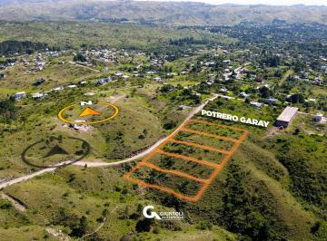

**#7** — **Santa María, Córdoba**

- **Precio:** USD 14.000
- **Superficie:** 1,000 m²
- **Precio/m²:** USD 14.00/m²
- Venta de lote en Potrero de Garay, lote con hermosas vistas a las sierras. Se ubica a unos 1000 metros de la Ruta, en un
- Venta de lote en Potrero de Garay, lote con hermosas vistas a las sierras.
Se ubica a unos 1000 metros de la Ruta, en una de las zonas más altas del barrio.
El terreno cuenta con:
-1000 m2
- Pendiente
- [Ver publicación](https://www.zonaprop.com.ar/propiedades/clasificado/vecltrin-lote-de-1.000-m-en-villa-ciudad-de-america-potrero-de-58213651.html?n_src=Listado&n_pg=2&n_pos=12)


**#8** — **Ascochinga, Córdoba**

- **Precio:** USD 145.000
- **Superficie:** 10,350 m²
- **Precio/m²:** USD 14.01/m²
- Lote en Barrio de Campo, Estancia La Paz, Ascochinga. 10. 350m² Estancia La Paz es un hotel. Un barrio de campo. Una can
- [Ver publicación](https://www.zonaprop.com.ar/propiedades/clasificado/vecltrin-terreno-en-venta-frente-golf-estancia-la-paz-58395129.html?n_src=Listado&n_pg=4&n_pos=30)

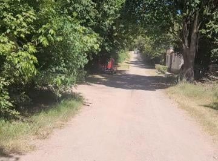

**#9** — **La Granja, Córdoba**

- **Precio:** USD 15.900
- **Superficie:** 1,050 m²
- **Precio/m²:** USD 15.14/m²
- Lopez baena propiedades, Te ofrece: una gran oportunidad!. Lote de 1. 050 M2 en villa animi- la granjasi soñaste con la 
- [Ver publicación](https://www.zonaprop.com.ar/propiedades/clasificado/vecltrin-vendo-terreno-1050-m-sup2--en-la-granja!-oportunidad-53238979.html?n_src=Listado&n_pg=3&n_pos=24)

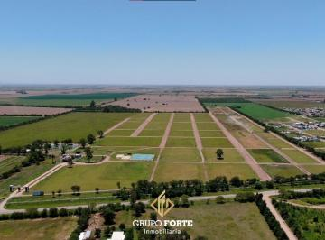

**#10** — **Monte Cristo, Córdoba**

- **Precio:** USD 5.000
- **Superficie:** 322 m²
- **Precio/m²:** USD 15.53/m²
- Gran Oportunidad en Monte Cristo "La Rochelle" Villa Exclusiva. - Lotes financiados. Un concepto de barrio privado de ca
- Gran Oportunidad en Monte Cristo "La Rochelle" Villa Exclusiva.
- Lotes financiados.

Un concepto de barrio privado de categoría, vanguardista, en una zona muy tranquila y cerca de todo. Único en la z
- [Ver publicación](https://www.zonaprop.com.ar/propiedades/clasificado/vecltrin-oportunidad-de-invertir-lotes-financiados-la-rochelle-57784763.html?n_src=Listado&n_pg=1&n_pos=7)

---

### Más Económicos (precio total)


**#1** — **Monte Cristo, Córdoba**

- **Precio:** USD 5.000
- **Superficie:** 322 m²
- **Precio/m²:** USD 15.53/m²
- Gran Oportunidad en Monte Cristo "La Rochelle" Villa Exclusiva. - Lotes financiados. Un concepto de barrio privado de ca
- Gran Oportunidad en Monte Cristo "La Rochelle" Villa Exclusiva.
- Lotes financiados.

Un concepto de barrio privado de categoría, vanguardista, en una zona muy tranquila y cerca de todo. Único en la z
- [Ver publicación](https://www.zonaprop.com.ar/propiedades/clasificado/vecltrin-oportunidad-de-invertir-lotes-financiados-la-rochelle-57784763.html?n_src=Listado&n_pg=1&n_pos=7)


**#2** — **Monte Cristo, Córdoba**

- **Precio:** USD 5.000
- **Superficie:** 322 m²
- **Precio/m²:** USD 15.53/m²
- Gran Oportunidad en Monte Cristo "La Rochelle" Villa Exclusiva. - Lotes financiados. Un concepto de barrio privado de ca
- [Ver publicación](https://www.zonaprop.com.ar/propiedades/clasificado/vecltrin-oportunidad-de-invertir-lotes-financiados-la-rochelle-57784763.html?n_src=Listado&n_pg=2&n_pos=25)

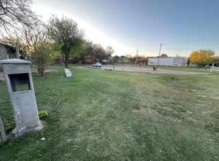

**#3** — **Unquillo, Córdoba**

- **Precio:** USD 10.000
- **Superficie:** 502 m²
- **Precio/m²:** USD 19.92/m²
- Lopez baena propiedades presenta para la Venta este hermoso Lote de 500 M2, con una ubicación super tranquila en Unquill
- [Ver publicación](https://www.zonaprop.com.ar/propiedades/clasificado/vecltrin-vendo-lote-de-500-m-llano-en-unquillo!-total-57189080.html?n_src=Listado&n_pg=5&n_pos=30)


**#4** — **Santa María, Córdoba**

- **Precio:** USD 14.000
- **Superficie:** 1,000 m²
- **Precio/m²:** USD 14.00/m²
- Venta de lote en Potrero de Garay, lote con hermosas vistas a las sierras. Se ubica a unos 1000 metros de la Ruta, en un
- Venta de lote en Potrero de Garay, lote con hermosas vistas a las sierras.
Se ubica a unos 1000 metros de la Ruta, en una de las zonas más altas del barrio.
El terreno cuenta con:
-1000 m2
- Pendiente
- [Ver publicación](https://www.zonaprop.com.ar/propiedades/clasificado/vecltrin-lote-de-1.000-m-en-villa-ciudad-de-america-potrero-de-58213651.html?n_src=Listado&n_pg=2&n_pos=12)


**#5** — **La Granja, Córdoba**

- **Precio:** USD 15.900
- **Superficie:** 1,050 m²
- **Precio/m²:** USD 15.14/m²
- Lopez baena propiedades, Te ofrece: una gran oportunidad!. Lote de 1. 050 M2 en villa animi- la granjasi soñaste con la 
- [Ver publicación](https://www.zonaprop.com.ar/propiedades/clasificado/vecltrin-vendo-terreno-1050-m-sup2--en-la-granja!-oportunidad-53238979.html?n_src=Listado&n_pg=3&n_pos=24)

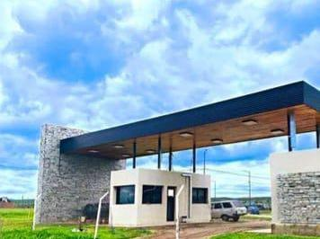

**#6** — **Malagueño, Córdoba**

- **Precio:** USD 16.500
- **Superficie:** 270 m²
- **Precio/m²:** USD 61.11/m²
- Lopezbaena propiedades, Te ofrece: Un lote de 270 m2 en la ernestina barrio de campou$S 16. 500La ubicación es mas que e
- [Ver publicación](https://www.zonaprop.com.ar/propiedades/clasificado/vecltrin-vendo-lote-barrio-cerrado-la-ernestina-malagueno-58218567.html?n_src=Listado&n_pills=Encargado&n_pg=4&n_pos=5)

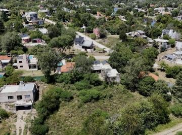

**#7** — **San Antonio de Arredondo, Córdoba**

- **Precio:** USD 17.500
- **Superficie:** 749 m²
- **Precio/m²:** USD 23.36/m²
- Inmobiliaria carolina brochero vende: Lote de terreno en venta en la localidad de San Antonio De Arredondo, ubicada en e
- [Ver publicación](https://www.zonaprop.com.ar/propiedades/clasificado/vecltrin-lote-en-venta-en-san-antonio-de-arredondo-cerca-del-58466012.html?n_src=Listado&n_pg=3&n_pos=2)


**#8** — **Barrio de Campo El Sereno, Villa Yacanto**

- **Precio:** USD 20.200
- **Superficie:** 1,868 m²
- **Precio/m²:** USD 10.81/m²
- Lote en venta en Barrio El Sereno, Yacanto. El Sereno, en zona de Yacanto, se encuentra en un entorno natural privilegia
- [Ver publicación](https://www.zonaprop.com.ar/propiedades/clasificado/vecltrin-terreno-en-venta-barrio-de-campo-el-sereno-yacanto-58413978.html?n_src=Listado&n_pg=4&n_pos=13)

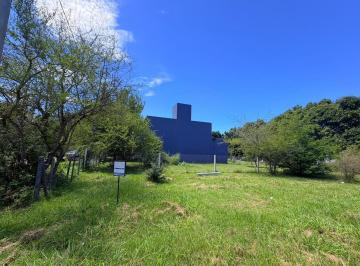

**#9** — **Villa Catalina, Río Ceballos**

- **Precio:** USD 22.000
- **Superficie:** 300 m²
- **Precio/m²:** USD 73.33/m²
- En esta oportunidad Grimaut Lopez propiedades ofrece lote en venta en barrio cerrado Villa Catalina, ubicado en Rio Ceba
- [Ver publicación](https://www.zonaprop.com.ar/propiedades/clasificado/vecltrin-lote-en-venta-en-villa-catalina-58445488.html?n_src=Listado&n_pg=5&n_pos=1)

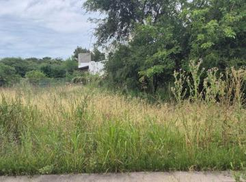

**#10** — **Villa Catalina, Río Ceballos**

- **Precio:** USD 22.900
- **Superficie:** 530 m²
- **Precio/m²:** USD 43.21/m²
- En esta oportunidad te ofrecemos a la venta un terreno en Barrio Prossur, sobre la E- 53, un lugar en pleno desarrollo c
- [Ver publicación](https://www.zonaprop.com.ar/propiedades/clasificado/vecltrin-terreno-prossur-rio-ceballos-530-m-sup2--barrio-58020148.html?n_src=Listado&n_pills=Apto+cr%C3%A9dito&n_pg=4&n_pos=22)

---

### Terrenos Más Grandes


**#1** — **Santa María de Punilla, Córdoba**

- **Precio:** USD 470.000
- **Superficie:** 370,000 m²
- **Precio/m²:** USD 1.27/m²
- LopezBaena comercializa una muy buena oportunidad de emprendimiento! Se trata de 34 hectáreas declaradas en la localidad
- LopezBaena comercializa una MUY BUENA OPORTUNIDAD DE EMPRENDIMIENTO!

Se trata de 34 hectáreas declaradas en la localidad de Cabalango, a 3Km de la ruta de Tanti - Cabalango se encuentran estas tierra
- [Ver publicación](https://www.zonaprop.com.ar/propiedades/clasificado/vecltrin-vendo-terreno-en-cabalango-con-2-arroyos-37-58220315.html?n_src=Listado&n_pg=1&n_pos=22)


**#2** — **Colonia Caroya, Córdoba**

- **Precio:** USD 170.000
- **Superficie:** 53,000 m²
- **Precio/m²:** USD 3.21/m²
- Grupo norte vende. ¡gran oportunidad! Gran lote de 53. 000 M² ideal para siembra O desarrollo productivo. Ubicado en un 
- GRUPO NORTE VENDE

¡GRAN OPORTUNIDAD!

GRAN LOTE DE 53.000 M² IDEAL PARA SIEMBRA O DESARROLLO PRODUCTIVO.

UBICADO EN UN ENTORNO NATURAL PRIVILEGIADO, CON EXCELENTE ACCESIBILIDAD Y SERVICIOS DISPONIBL
- [Ver publicación](https://www.zonaprop.com.ar/propiedades/clasificado/vecltrin-venta-campo-de-5-3-ha-ideal-para-producir-56901548.html?n_src=Listado&n_pg=2&n_pos=16)


**#3** — **Villa Allende Golf, Villa Allende**

- **Precio:** USD 2.210.000
- **Superficie:** 34,000 m²
- **Precio/m²:** USD 65.00/m²
- Es una importantísima fracción de 34. 000 metros cuadrados, excelentemente ubicados sobre la Avenida Argentina, en el ba
- [Ver publicación](https://www.zonaprop.com.ar/propiedades/clasificado/vecltrin-terreno-en-venta-apto-housing-56234840.html?n_src=Listado&n_pills=Pileta&n_pg=4&n_pos=18)

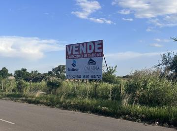

**#4** — **Villa Allende, Córdoba**

- **Precio:** USD 4.111.120
- **Superficie:** 31,624 m²
- **Precio/m²:** USD 130.00/m²
- Excelente Oportunidad Inmobiliaria. Terreno en inmejorable ubicacion, en corredor C1 Lucchese - sobre colectora mano dir
- Excelente Oportunidad Inmobiliaria. Terreno en inmejorable ubicacion, en corredor C1 Lucchese - sobre colectora mano direccion VA a CBA altura Colegio Torreon - mano de enfrente al colegio.

El presen
- [Ver publicación](https://www.zonaprop.com.ar/propiedades/clasificado/vecltrin-terreno-en-corredor-lucchese-55212128.html?n_src=Listado&n_pills=Apto+cr%C3%A9dito&n_pg=1&n_pos=6)


**#5** — **Villa Allende, Córdoba**

- **Precio:** USD 4.111.120
- **Superficie:** 31,624 m²
- **Precio/m²:** USD 130.00/m²
- Excelente Oportunidad Inmobiliaria. Terreno en inmejorable ubicacion, en corredor C1 Lucchese - sobre colectora mano dir
- [Ver publicación](https://www.zonaprop.com.ar/propiedades/clasificado/vecltrin-terreno-en-corredor-lucchese-55212128.html?n_src=Listado&n_pills=Apto+cr%C3%A9dito&n_pg=3&n_pos=26)


**#6** — **Ascochinga, Córdoba**

- **Precio:** USD 145.000
- **Superficie:** 10,350 m²
- **Precio/m²:** USD 14.01/m²
- Lote en Barrio de Campo, Estancia La Paz, Ascochinga. 10. 350m² Estancia La Paz es un hotel. Un barrio de campo. Una can
- [Ver publicación](https://www.zonaprop.com.ar/propiedades/clasificado/vecltrin-terreno-en-venta-frente-golf-estancia-la-paz-58395129.html?n_src=Listado&n_pg=4&n_pos=30)

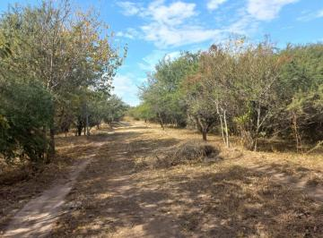

**#7** — **Villa Allende Golf, Villa Allende**

- **Precio:** USD 249.000
- **Superficie:** 6,000 m²
- **Precio/m²:** USD 41.50/m²
- Se vende lote en Villa Allende Golf, apto 6 unidadesCaracterísticas: -6000 M2- Factor de ocupación del suelo, F. O. S: 3
- Se vende lote en Villa Allende Golf, apto 6 unidades
Características:
-6000 M2
- Factor de ocupación del suelo, F.O.S: 30%
- Factor de ocupación total, F.O.T : 0,60.
- Índice Unidades Funcionales Habi
- [Ver publicación](https://www.zonaprop.com.ar/propiedades/clasificado/vecltrin-terreno-villa-allende-golf-apto-6-unidades-56880644.html?n_src=Listado&n_pg=1&n_pos=20)


**#8** — **Ascochinga, Córdoba**

- **Precio:** USD 130.000
- **Superficie:** 6,000 m²
- **Precio/m²:** USD 21.67/m²
- Lote 114 Mza 20 Sierras - Estancia La Paz - Ascochinga CórdobaEstancia La Paz - Naturaleza, Historia y Estilo de Vida en
- [Ver publicación](https://www.zonaprop.com.ar/propiedades/clasificado/vecltrin-venta-de-lote-en-estancia-la-paz-ascochinga-58247170.html?n_src=Listado&n_pills=Encargado&n_pg=4&n_pos=15)


**#9** — **Ascochinga, Córdoba**

- **Precio:** USD 50.400
- **Superficie:** 5,000 m²
- **Precio/m²:** USD 10.08/m²
- Lotes de 5. 000 m² en El Buen Aire Viví rodeado de naturaleza. En un rincón único entre Ascochinga y la Estancia Jesuíti
- Lotes de 5.000 m² en El Buen Aire Viví rodeado de naturaleza

En un rincón único entre Ascochinga y la Estancia Jesuítica Santa Catalina, se encuentra El Buen Aire, un barrio con seguridad en un entor
- [Ver publicación](https://www.zonaprop.com.ar/propiedades/clasificado/vecltrin-terrenos-en-venta-de-5000-m-sup2--en-el-buen-aire-57412066.html?n_src=Listado&n_pills=Encargado&n_pg=2&n_pos=13)


**#10** — **Río Ceballos, Córdoba**

- **Precio:** USD 29.000
- **Superficie:** 4,380 m²
- **Precio/m²:** USD 6.62/m²
- Potrero del alto - chacras de montaña. venta lotes desde 4000 M2. Camino del cuadrado. Rio ceballos. Córdoba. - Ubicació
- [Ver publicación](https://www.zonaprop.com.ar/propiedades/clasificado/vecltrin-potrero-del-alto-camino-del-cuadrado-venta-lotes-54163368.html?n_src=Listado&n_pills=Encargado&n_pg=3&n_pos=5)

---

## Análisis por Zona

| Zona | Cant. | Precio/m² Prom. | Precio/m² Mín. | Precio/m² Máx. | Precio Prom. | Sup. Prom. |
|------|------:|----------------:|---------------:|---------------:|-------------:|-----------:|
| Santa María de Punilla | 1 | $1.27 | $1.27 | $1.27 | $470,000 | 370,000 m² |
| Colonia Caroya | 1 | $3.21 | $3.21 | $3.21 | $170,000 | 53,000 m² |
| Barrio de Campo El Sereno | 1 | $10.81 | $10.81 | $10.81 | $20,200 | 1,868 m² |
| Los Cocos | 1 | $12.50 | $12.50 | $12.50 | $25,000 | 2,000 m² |
| La Granja | 1 | $15.14 | $15.14 | $15.14 | $15,900 | 1,050 m² |
| Ascochinga | 3 | $15.25 | $10.08 | $21.67 | $108,467 | 7,117 m² |
| Monte Cristo | 2 | $15.53 | $15.53 | $15.53 | $5,000 | 322 m² |
| Alta Gracia | 1 | $16.99 | $16.99 | $16.99 | $70,999 | 4,179 m² |
| San Javier | 2 | $18.30 | $17.06 | $19.53 | $61,700 | 3,434 m² |
| Villa Parque Siquiman | 1 | $20.83 | $20.83 | $20.83 | $30,000 | 1,440 m² |
| San Antonio de Arredondo | 1 | $23.36 | $23.36 | $23.36 | $17,500 | 749 m² |
| La Falda | 1 | $31.09 | $31.09 | $31.09 | $73,000 | 2,348 m² |
| Río Ceballos | 4 | $39.87 | $6.62 | $71.43 | $36,000 | 1,889 m² |
| Carlos Paz Golf Country Club | 1 | $42.62 | $42.62 | $42.62 | $58,000 | 1,361 m² |
| Unquillo | 5 | $44.76 | $19.92 | $57.14 | $22,600 | 514 m² |
| Río Segundo | 1 | $45.30 | $45.30 | $45.30 | $54,000 | 1,192 m² |
| Villa del Lago | 4 | $47.98 | $28.95 | $74.07 | $49,250 | 1,136 m² |
| El Potrerillo de Larreta | 1 | $49.36 | $49.36 | $49.36 | $115,000 | 2,330 m² |
| Santa María | 3 | $50.22 | $14.00 | $86.67 | $61,333 | 1,100 m² |
| Villa Allende Golf | 2 | $53.25 | $41.50 | $65.00 | $1,229,500 | 20,000 m² |
| Colón | 3 | $54.55 | $38.00 | $72.22 | $41,300 | 880 m² |
| Villa Catalina | 2 | $58.27 | $43.21 | $73.33 | $22,450 | 415 m² |
| La Cumbre | 1 | $64.23 | $64.23 | $64.23 | $44,000 | 685 m² |
| Valle del Golf | 2 | $68.69 | $57.38 | $80.00 | $90,500 | 1,282 m² |
| La Deseada Country | 4 | $70.13 | $51.60 | $84.83 | $88,155 | 1,312 m² |
| Quintas de Flores | 2 | $71.84 | $71.84 | $71.84 | $137,000 | 1,907 m² |
| La Cercania | 1 | $73.00 | $73.00 | $73.00 | $73,000 | 1,000 m² |
| Villa Warcalde | 2 | $74.04 | $72.35 | $75.74 | $190,000 | 2,538 m² |
| Tejas 4 | 3 | $85.81 | $76.00 | $91.43 | $33,833 | 400 m² |
| Balcones del Este | 1 | $96.00 | $96.00 | $96.00 | $24,000 | 250 m² |
| Talar del Este | 1 | $96.81 | $96.81 | $96.81 | $34,850 | 360 m² |
| Estancia Q2 | 3 | $103.00 | $76.83 | $134.29 | $140,667 | 1,424 m² |
| Terrazas de La Estanzuela | 1 | $104.39 | $104.39 | $104.39 | $49,900 | 478 m² |
| Los Molinos | 2 | $106.01 | $69.96 | $142.07 | $404,500 | 3,536 m² |
| San Alfonso del Talar | 1 | $111.11 | $111.11 | $111.11 | $70,000 | 630 m² |
| Malagueño | 6 | $113.44 | $21.82 | $220.00 | $136,333 | 1,089 m² |
| Córdoba | 3 | $114.32 | $44.50 | $176.25 | $61,667 | 919 m² |
| Villa Allende | 3 | $127.69 | $123.08 | $130.00 | $2,767,413 | 21,299 m² |
| La Cuesta | 1 | $131.19 | $131.19 | $131.19 | $159,000 | 1,212 m² |
| Docta Central | 4 | $135.29 | $124.05 | $146.00 | $36,000 | 266 m² |
| DOCTA | 3 | $137.57 | $134.72 | $140.00 | $39,333 | 287 m² |
| Campos de Manantiales | 1 | $139.05 | $139.05 | $139.05 | $47,000 | 338 m² |
| Maitenes de La Deseada | 1 | $141.28 | $141.28 | $141.28 | $64,000 | 453 m² |
| Chacras de la Villa | 1 | $149.40 | $149.40 | $149.40 | $149,400 | 1,000 m² |
| Cuestas de Manantiales | 2 | $159.17 | $146.34 | $172.00 | $42,500 | 268 m² |
| Manantiales | 8 | $160.87 | $146.67 | $200.00 | $47,125 | 295 m² |
| Docta Parque | 1 | $163.89 | $163.89 | $163.89 | $59,000 | 360 m² |
| Estancia El Terrón | 2 | $167.78 | $159.53 | $176.03 | $216,000 | 1,278 m² |
| Las Cañitas Barrio Privado | 5 | $168.55 | $140.95 | $216.67 | $73,600 | 450 m² |
| Pampas de Manantiales | 1 | $168.57 | $168.57 | $168.57 | $59,000 | 350 m² |
| San Isidro | 1 | $171.43 | $171.43 | $171.43 | $180,000 | 1,050 m² |
| Comarca de Allende | 1 | $172.22 | $172.22 | $172.22 | $62,000 | 360 m² |
| Docta Boulevard | 1 | $172.50 | $172.50 | $172.50 | $62,100 | 360 m² |
| La Cascada Country Golf | 1 | $173.33 | $173.33 | $173.33 | $260,000 | 1,500 m² |
| La Calera | 2 | $179.47 | $164.08 | $194.86 | $147,000 | 790 m² |
| Nobu Town | 1 | $180.56 | $180.56 | $180.56 | $65,000 | 360 m² |
| San Ignacio Village | 1 | $184.48 | $184.48 | $184.48 | $72,500 | 393 m² |
| Docta Avenida | 6 | $184.57 | $137.54 | $244.44 | $68,583 | 385 m² |
| San Lorenzo | 1 | $190.48 | $190.48 | $190.48 | $120,000 | 630 m² |
| Nuevo Malagueño | 1 | $207.55 | $207.55 | $207.55 | $55,000 | 265 m² |
| Los Boulevares | 1 | $210.53 | $210.53 | $210.53 | $80,000 | 380 m² |
| Siete Soles Naturaleza Urbana | 1 | $216.67 | $216.67 | $216.67 | $130,000 | 600 m² |
| Distrito Sur | 2 | $219.44 | $219.44 | $219.44 | $79,000 | 360 m² |
| Acquavista | 1 | $231.02 | $231.02 | $231.02 | $70,000 | 303 m² |
| Solares de Manantiales | 2 | $231.74 | $184.78 | $278.69 | $85,000 | 382 m² |
| Lomas de la Carolina | 1 | $232.40 | $232.40 | $232.40 | $350,000 | 1,506 m² |
| Las Delicias | 1 | $238.60 | $238.60 | $238.60 | $450,000 | 1,886 m² |
| Costas de Manantiales | 1 | $250.00 | $250.00 | $250.00 | $105,000 | 420 m² |
| La Calandria | 1 | $263.89 | $263.89 | $263.89 | $95,000 | 360 m² |
| Tejas II | 1 | $275.59 | $275.59 | $275.59 | $70,000 | 254 m² |
| Güemes | 2 | $279.36 | $183.72 | $375.00 | $186,500 | 911 m² |
| Jardín Inglés | 1 | $293.75 | $293.75 | $293.75 | $235,000 | 800 m² |
| Campo Chico Urbanización Residencia | 1 | $319.44 | $319.44 | $319.44 | $115,000 | 360 m² |
| Mansos del Sur | 1 | $321.95 | $321.95 | $321.95 | $132,000 | 410 m² |
| Greenville II | 2 | $324.18 | $324.18 | $324.18 | $118,000 | 364 m² |
| Nueva Córdoba | 1 | $472.44 | $472.44 | $472.44 | $300,000 | 635 m² |
| Centro | 1 | $558.66 | $558.66 | $558.66 | $200,000 | 358 m² |
| General Paz | 1 | $1,250.00 | $1,250.00 | $1,250.00 | $320,000 | 256 m² |

---

## Listado Completo

| # | Imagen | Ubicación | Superficie | Precio | Precio/m² | Link |
|--:|--------|-----------|----------:|-------:|----------:|------|
| 1 |  | Santa María de Punilla, Córdoba | 370,000 m² | USD 470.000 | $1.27 | [Ver](https://www.zonaprop.com.ar/propiedades/clasificado/vecltrin-vendo-terreno-en-cabalango-con-2-arroyos-37-58220315.html?n_src=Listado&n_pg=1&n_pos=22) |
| 2 |  | Colonia Caroya, Córdoba | 53,000 m² | USD 170.000 | $3.21 | [Ver](https://www.zonaprop.com.ar/propiedades/clasificado/vecltrin-venta-campo-de-5-3-ha-ideal-para-producir-56901548.html?n_src=Listado&n_pg=2&n_pos=16) |
| 3 |  | Río Ceballos, Córdoba | 4,380 m² | USD 29.000 | $6.62 | [Ver](https://www.zonaprop.com.ar/propiedades/clasificado/vecltrin-potrero-del-alto-camino-del-cuadrado-venta-lotes-54163368.html?n_src=Listado&n_pills=Encargado&n_pg=3&n_pos=5) |
| 4 |  | Ascochinga, Córdoba | 5,000 m² | USD 50.400 | $10.08 | [Ver](https://www.zonaprop.com.ar/propiedades/clasificado/vecltrin-terrenos-en-venta-de-5000-m-sup2--en-el-buen-aire-57412066.html?n_src=Listado&n_pills=Encargado&n_pg=2&n_pos=13) |
| 5 |  | Barrio de Campo El Sereno, Villa Yacanto | 1,868 m² | USD 20.200 | $10.81 | [Ver](https://www.zonaprop.com.ar/propiedades/clasificado/vecltrin-terreno-en-venta-barrio-de-campo-el-sereno-yacanto-58413978.html?n_src=Listado&n_pg=4&n_pos=13) |
| 6 |  | Los Cocos, Córdoba | 2,000 m² | USD 25.000 | $12.50 | [Ver](https://www.zonaprop.com.ar/propiedades/clasificado/vecltrin-ultimos-2-lotes-!-los-cocos-b-jardin-financiacion-58220249.html?n_src=Listado&n_pg=3&n_pos=19) |
| 7 |  | Santa María, Córdoba | 1,000 m² | USD 14.000 | $14.00 | [Ver](https://www.zonaprop.com.ar/propiedades/clasificado/vecltrin-lote-de-1.000-m-en-villa-ciudad-de-america-potrero-de-58213651.html?n_src=Listado&n_pg=2&n_pos=12) |
| 8 |  | Ascochinga, Córdoba | 10,350 m² | USD 145.000 | $14.01 | [Ver](https://www.zonaprop.com.ar/propiedades/clasificado/vecltrin-terreno-en-venta-frente-golf-estancia-la-paz-58395129.html?n_src=Listado&n_pg=4&n_pos=30) |
| 9 |  | La Granja, Córdoba | 1,050 m² | USD 15.900 | $15.14 | [Ver](https://www.zonaprop.com.ar/propiedades/clasificado/vecltrin-vendo-terreno-1050-m-sup2--en-la-granja!-oportunidad-53238979.html?n_src=Listado&n_pg=3&n_pos=24) |
| 10 |  | Monte Cristo, Córdoba | 322 m² | USD 5.000 | $15.53 | [Ver](https://www.zonaprop.com.ar/propiedades/clasificado/vecltrin-oportunidad-de-invertir-lotes-financiados-la-rochelle-57784763.html?n_src=Listado&n_pg=1&n_pos=7) |
| 11 |  | Monte Cristo, Córdoba | 322 m² | USD 5.000 | $15.53 | [Ver](https://www.zonaprop.com.ar/propiedades/clasificado/vecltrin-oportunidad-de-invertir-lotes-financiados-la-rochelle-57784763.html?n_src=Listado&n_pg=2&n_pos=25) |
| 12 |  | Alta Gracia, Córdoba | 4,179 m² | USD 70.999 | $16.99 | [Ver](https://www.zonaprop.com.ar/propiedades/clasificado/vecltrin-terreno-en-venta-campos-del-virrey-58369841.html?n_src=Listado&n_pg=1&n_pos=17) |
| 13 |  | San Javier, Córdoba | 4,338 m² | USD 74.000 | $17.06 | [Ver](https://www.zonaprop.com.ar/propiedades/clasificado/vecltrin-terreno-en-venta-en-barrio-san-onofre-san-javier-58226843.html?n_src=Listado&n_pills=Apto+cr%C3%A9dito&n_pg=2&n_pos=22) |
| 14 |  | San Javier, Córdoba | 2,530 m² | USD 49.400 | $19.53 | [Ver](https://www.zonaprop.com.ar/propiedades/clasificado/vecltrin-venta-de-lote-terreno-en-la-matilde-comarca-57844164.html?n_src=Listado&n_pills=Pileta&n_pg=3&n_pos=18) |
| 15 |  | Unquillo, Córdoba | 502 m² | USD 10.000 | $19.92 | [Ver](https://www.zonaprop.com.ar/propiedades/clasificado/vecltrin-vendo-lote-de-500-m-llano-en-unquillo!-total-57189080.html?n_src=Listado&n_pg=5&n_pos=30) |
| 16 | 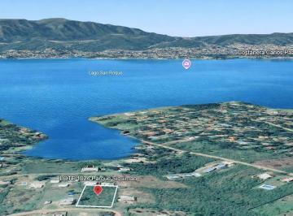 | Villa Parque Siquiman, Córdoba | 1,440 m² | USD 30.000 | $20.83 | [Ver](https://www.zonaprop.com.ar/propiedades/clasificado/vecltrin-terreno-lote-en-venta-en-villa-parque-siquiman-58141671.html?n_src=Listado&n_pg=1&n_pos=3) |
| 17 |  | Río Ceballos, Córdoba | 2,100 m² | USD 45.000 | $21.43 | [Ver](https://www.zonaprop.com.ar/propiedades/clasificado/vecltrin-vendo-lote-2100-m-sup2--inmejorable-vista-barrio-58219493.html?n_src=Listado&n_pg=4&n_pos=26) |
| 18 |  | Ascochinga, Córdoba | 6,000 m² | USD 130.000 | $21.67 | [Ver](https://www.zonaprop.com.ar/propiedades/clasificado/vecltrin-venta-de-lote-en-estancia-la-paz-ascochinga-58247170.html?n_src=Listado&n_pills=Encargado&n_pg=4&n_pos=15) |
| 19 | 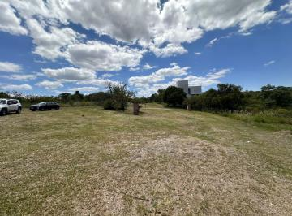 | Malagueño, Córdoba | 1,925 m² | USD 42.000 | $21.82 | [Ver](https://www.zonaprop.com.ar/propiedades/clasificado/vecltrin-terreno-1925-m-sup2--tierraalta-gran-oportunidad-58193246.html?n_src=Listado&n_pg=5&n_pos=6) |
| 20 |  | San Antonio de Arredondo, Córdoba | 749 m² | USD 17.500 | $23.36 | [Ver](https://www.zonaprop.com.ar/propiedades/clasificado/vecltrin-lote-en-venta-en-san-antonio-de-arredondo-cerca-del-58466012.html?n_src=Listado&n_pg=3&n_pos=2) |
| 21 |  | Villa del Lago, Villa Carlos Paz | 1,727 m² | USD 50.000 | $28.95 | [Ver](https://www.zonaprop.com.ar/propiedades/clasificado/vecltrin-terreno-en-villa-del-lago-57840342.html?n_src=Listado&n_pg=2&n_pos=24) |
| 22 | 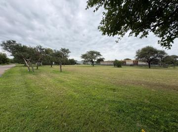 | La Falda, Córdoba | 2,348 m² | USD 73.000 | $31.09 | [Ver](https://www.zonaprop.com.ar/propiedades/clasificado/vecltrin-terreno-en-venta-en-estacion-del-carmen-2348-m-sup2-57433794.html?n_src=Listado&n_pg=4&n_pos=6) |
| 23 |  | Colón, Córdoba | 1,550 m² | USD 58.900 | $38.00 | [Ver](https://www.zonaprop.com.ar/propiedades/clasificado/vecltrin-lote-en-venta-estancia-san-miguel-salsipuedes-58055541.html?n_src=Listado&n_pills=SUM&n_pg=2&n_pos=23) |
| 24 | 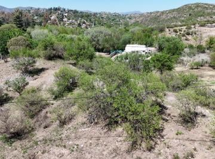 | Villa del Lago, Villa Carlos Paz | 1,181 m² | USD 45.000 | $38.10 | [Ver](https://www.zonaprop.com.ar/propiedades/clasificado/vecltrin-terreno-en-villa-del-lago-57095239.html?n_src=Listado&n_pg=2&n_pos=11) |
| 25 | 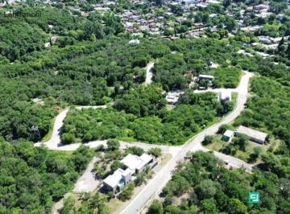 | Unquillo, Córdoba | 680 m² | USD 26.500 | $38.97 | [Ver](https://www.zonaprop.com.ar/propiedades/clasificado/vecltrin-oportunidad-lote-en-lomas-del-cigarral-58133457.html?n_src=Listado&n_pills=Terraza&n_pg=1&n_pos=23) |
| 26 |  | Villa Allende Golf, Villa Allende | 6,000 m² | USD 249.000 | $41.50 | [Ver](https://www.zonaprop.com.ar/propiedades/clasificado/vecltrin-terreno-villa-allende-golf-apto-6-unidades-56880644.html?n_src=Listado&n_pg=1&n_pos=20) |
| 27 | 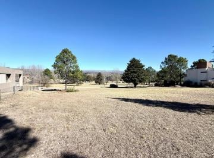 | Carlos Paz Golf Country Club, San Antonio de  | 1,361 m² | USD 58.000 | $42.62 | [Ver](https://www.zonaprop.com.ar/propiedades/clasificado/vecltrin-terreno-en-san-antonio-de-arredondo-country-carlos-paz-57346400.html?n_src=Listado&n_pg=2&n_pos=28) |
| 28 |  | Villa Catalina, Río Ceballos | 530 m² | USD 22.900 | $43.21 | [Ver](https://www.zonaprop.com.ar/propiedades/clasificado/vecltrin-terreno-prossur-rio-ceballos-530-m-sup2--barrio-58020148.html?n_src=Listado&n_pills=Apto+cr%C3%A9dito&n_pg=4&n_pos=22) |
| 29 | 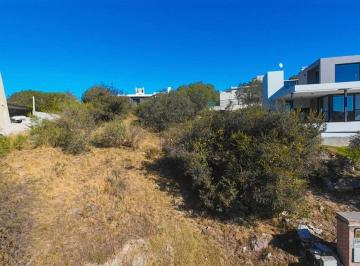 | Malagueño, Córdoba | 784 m² | USD 34.500 | $44.01 | [Ver](https://www.zonaprop.com.ar/propiedades/clasificado/vecltrin-terreno-en-venta-en-barrio-privado-tierra-alta-56662635.html?n_src=Listado&n_pg=1&n_pos=30) |
| 30 | 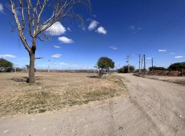 | Córdoba, Córdoba | 2,135 m² | USD 95.000 | $44.50 | [Ver](https://www.zonaprop.com.ar/propiedades/clasificado/vecltrin-fraccion-de-terreno-en-venta!-barrio-comercial-58049690.html?n_src=Listado&n_pg=2&n_pos=18) |
| 31 |  | Río Segundo, Córdoba | 1,192 m² | USD 54.000 | $45.30 | [Ver](https://www.zonaprop.com.ar/propiedades/clasificado/vecltrin-terreno-1200-m-villa-del-rosario-con-construccion-a-57935919.html?n_src=Listado&n_pg=4&n_pos=2) |
| 32 | 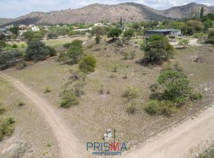 | El Potrerillo de Larreta, Alta Gracia | 2,330 m² | USD 115.000 | $49.36 | [Ver](https://www.zonaprop.com.ar/propiedades/clasificado/vecltrin-lote-en-venta-2330-m-sup2--fondo-golf-potrerrillo-de-49096151.html?n_src=Listado&n_pg=4&n_pos=19) |
| 33 | 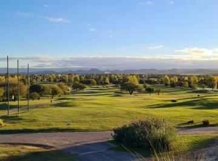 | Santa María, Córdoba | 800 m² | USD 40.000 | $50.00 | [Ver](https://www.zonaprop.com.ar/propiedades/clasificado/vecltrin-lotes-en-venta-800-m-sup2--valle-del-golf-57900103.html?n_src=Listado&n_pills=Encargado&n_pg=1&n_pos=1) |
| 34 | 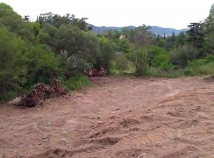 | Villa del Lago, Villa Carlos Paz | 827 m² | USD 42.000 | $50.79 | [Ver](https://www.zonaprop.com.ar/propiedades/clasificado/vecltrin-terreno-en-venta-en-villa-del-lago-54458628.html?n_src=Listado&n_pg=2&n_pos=14) |
| 35 | 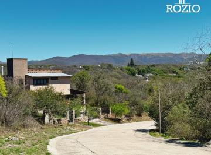 | Unquillo, Córdoba | 450 m² | USD 23.000 | $51.11 | [Ver](https://www.zonaprop.com.ar/propiedades/clasificado/vecltrin-terrenos-en-lomas-del-cigarral-unquillo-58195050.html?n_src=Listado&n_pills=Apto+cr%C3%A9dito&n_pg=3&n_pos=8) |
| 36 | 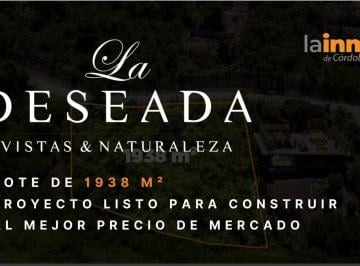 | La Deseada Country, La Calera | 1,938 m² | USD 100.000 | $51.60 | [Ver](https://www.zonaprop.com.ar/propiedades/clasificado/vecltrin-lote-en-venta-en-la-deseada-57821671.html?n_src=Listado&n_pills=Encargado&n_pg=3&n_pos=25) |
| 37 |  | Colón, Córdoba | 730 m² | USD 39.000 | $53.42 | [Ver](https://www.zonaprop.com.ar/propiedades/clasificado/vecltrin-colonia-caroya-urbanizacion-aires-de-caroya-lote-58195059.html?n_src=Listado&n_pills=Apto+cr%C3%A9dito&n_pg=4&n_pos=21) |
| 38 | 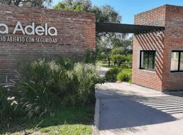 | Unquillo, Córdoba | 450 m² | USD 25.500 | $56.67 | [Ver](https://www.zonaprop.com.ar/propiedades/clasificado/vecltrin-terreno-barrio-con-seguridad-en-unquillo-55670805.html?n_src=Listado&n_pills=Encargado&n_pg=3&n_pos=14) |
| 39 | 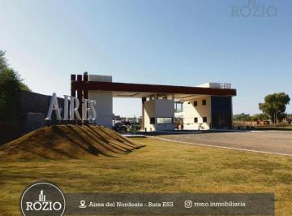 | Unquillo, Córdoba | 490 m² | USD 28.000 | $57.14 | [Ver](https://www.zonaprop.com.ar/propiedades/clasificado/vecltrin-terrenos-en-aires-del-nordeste-posesion-inmediata-58424138.html?n_src=Listado&n_pills=Encargado&n_pg=3&n_pos=6) |
| 40 | 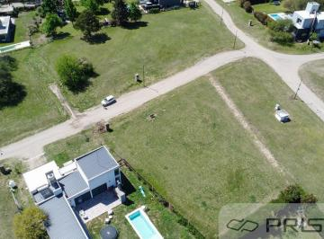 | Valle del Golf, Malagueño | 1,063 m² | USD 61.000 | $57.38 | [Ver](https://www.zonaprop.com.ar/propiedades/clasificado/vecltrin-lote-1063-m-sup2--valle-del-golf-57239272.html?n_src=Listado&n_pg=3&n_pos=27) |
| 41 |  | Río Ceballos, Córdoba | 600 m² | USD 36.000 | $60.00 | [Ver](https://www.zonaprop.com.ar/propiedades/clasificado/vecltrin-villa-catalina-lote-de-600-m-c-escritura-58195040.html?n_src=Listado&n_pills=SUM&n_pg=1&n_pos=18) |
| 42 |  | Malagueño, Córdoba | 270 m² | USD 16.500 | $61.11 | [Ver](https://www.zonaprop.com.ar/propiedades/clasificado/vecltrin-vendo-lote-barrio-cerrado-la-ernestina-malagueno-58218567.html?n_src=Listado&n_pills=Encargado&n_pg=4&n_pos=5) |
| 43 |  | La Cumbre, Córdoba | 685 m² | USD 44.000 | $64.23 | [Ver](https://www.zonaprop.com.ar/propiedades/clasificado/vecltrin-terreno-en-venta-la-cumbre.-escritura.-55151101.html?n_src=Listado&n_pg=3&n_pos=10) |
| 44 |  | Villa Allende Golf, Villa Allende | 34,000 m² | USD 2.210.000 | $65.00 | [Ver](https://www.zonaprop.com.ar/propiedades/clasificado/vecltrin-terreno-en-venta-apto-housing-56234840.html?n_src=Listado&n_pills=Pileta&n_pg=4&n_pos=18) |
| 45 |  | La Deseada Country, La Calera | 1,051 m² | USD 72.620 | $69.10 | [Ver](https://www.zonaprop.com.ar/propiedades/clasificado/vecltrin--venta!-lote-en-vistas-de-la-deseada-vistas-1-57247606.html?n_src=Listado&n_pg=5&n_pos=25) |
| 46 | 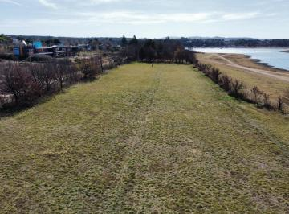 | Los Molinos, Córdoba | 2,716 m² | USD 190.000 | $69.96 | [Ver](https://www.zonaprop.com.ar/propiedades/clasificado/vecltrin-venta-de-lote-en-potrero-de-garay-con-costa-al-lago-56458807.html?n_src=Listado&n_pg=1&n_pos=27) |
| 47 | 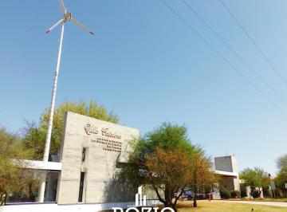 | Río Ceballos, Córdoba | 476 m² | USD 34.000 | $71.43 | [Ver](https://www.zonaprop.com.ar/propiedades/clasificado/vecltrin-villa-catalina-lotes-de-500-600-m-c-escritura-58195063.html?n_src=Listado&n_pills=Encargado&n_pg=2&n_pos=20) |
| 48 | 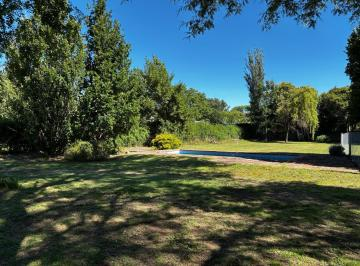 | Quintas de Flores, Córdoba | 1,907 m² | USD 137.000 | $71.84 | [Ver](https://www.zonaprop.com.ar/propiedades/clasificado/vecltrin-terreno-1900-m-sup2--en-quintas-de-flores-58259073.html?n_src=Listado&n_pg=1&n_pos=15) |
| 49 |  | Quintas de Flores, Córdoba | 1,907 m² | USD 137.000 | $71.84 | [Ver](https://www.zonaprop.com.ar/propiedades/clasificado/vecltrin-terreno-1900-m-sup2--en-quintas-de-flores-58259073.html?n_src=Listado&n_pg=3&n_pos=1) |
| 50 | 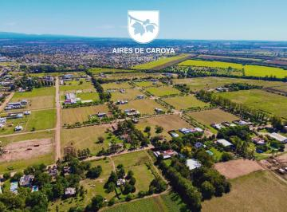 | Colón, Córdoba | 360 m² | USD 26.000 | $72.22 | [Ver](https://www.zonaprop.com.ar/propiedades/clasificado/vecltrin-terreno-en-venta-colonia-caroya-urbanizacion-aires-58195060.html?n_src=Listado&n_pg=5&n_pos=21) |
| 51 | 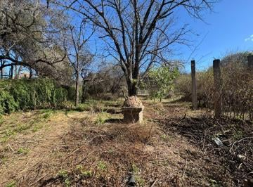 | Villa Warcalde, Córdoba | 1,313 m² | USD 95.000 | $72.35 | [Ver](https://www.zonaprop.com.ar/propiedades/clasificado/vecltrin-terreno-en-villa-warcalde-ideal-inversor-57136338.html?n_src=Listado&n_pg=4&n_pos=16) |
| 52 | 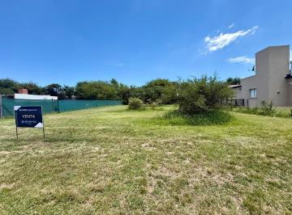 | La Cercania, Mendiolaza | 1,000 m² | USD 73.000 | $73.00 | [Ver](https://www.zonaprop.com.ar/propiedades/clasificado/vecltrin-se-vende-lote-fondo-norte-1000-mtos-en-la-cercania-58220224.html?n_src=Listado&n_pills=Quincho&n_pg=2&n_pos=27) |
| 53 |  | Villa Catalina, Río Ceballos | 300 m² | USD 22.000 | $73.33 | [Ver](https://www.zonaprop.com.ar/propiedades/clasificado/vecltrin-lote-en-venta-en-villa-catalina-58445488.html?n_src=Listado&n_pg=5&n_pos=1) |
| 54 |  | Villa del Lago, Villa Carlos Paz | 810 m² | USD 60.000 | $74.07 | [Ver](https://www.zonaprop.com.ar/propiedades/clasificado/vecltrin-terreno-en-villa-del-lago-57108418.html?n_src=Listado&n_pg=3&n_pos=20) |
| 55 | 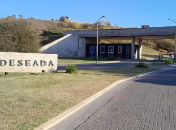 | La Deseada Country, La Calera | 1,200 m² | USD 90.000 | $75.00 | [Ver](https://www.zonaprop.com.ar/propiedades/clasificado/vecltrin-lotes-en-la-deseada-country-la-calera-58253942.html?n_src=Listado&n_pg=4&n_pos=7) |
| 56 | 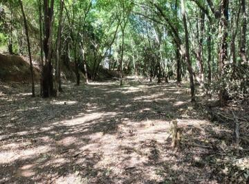 | Villa Warcalde, Córdoba | 3,763 m² | USD 285.000 | $75.74 | [Ver](https://www.zonaprop.com.ar/propiedades/clasificado/vecltrin-venta-de-terreno-en-villa-warcalde-3.763-mtrs.2-51926561.html?n_src=Listado&n_pg=2&n_pos=4) |
| 57 | 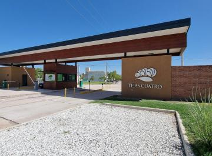 | Tejas 4, Malagueño | 500 m² | USD 38.000 | $76.00 | [Ver](https://www.zonaprop.com.ar/propiedades/clasificado/vecltrin-lote-en-venta-en-tejas-4-listo-para-construir-57459062.html?n_src=Listado&n_pills=Encargado&n_pg=4&n_pos=4) |
| 58 | 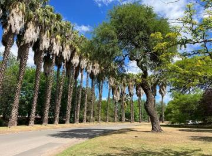 | Estancia Q2, Mendiolaza | 1,627 m² | USD 125.000 | $76.83 | [Ver](https://www.zonaprop.com.ar/propiedades/clasificado/vecltrin-terreno-estancia-q2.-1627-m-sup2-55336967.html?n_src=Listado&n_pills=Pileta&n_pg=2&n_pos=17) |
| 59 | 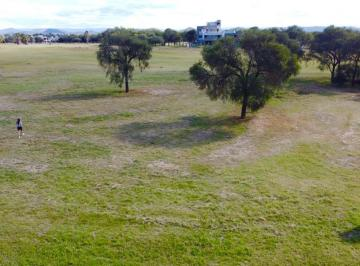 | Valle del Golf, Malagueño | 1,500 m² | USD 120.000 | $80.00 | [Ver](https://www.zonaprop.com.ar/propiedades/clasificado/vecltrin-venta-lote-con-fondo-golf-en-valle-del-golf-malagueno-58197513.html?n_src=Listado&n_pills=Encargado&n_pg=5&n_pos=3) |
| 60 | 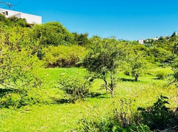 | La Deseada Country, La Calera | 1,061 m² | USD 90.000 | $84.83 | [Ver](https://www.zonaprop.com.ar/propiedades/clasificado/vecltrin-lote-en-venta-en-la-deseada-58252494.html?n_src=Listado&n_pg=3&n_pos=22) |
| 61 |  | Santa María, Córdoba | 1,500 m² | USD 130.000 | $86.67 | [Ver](https://www.zonaprop.com.ar/propiedades/clasificado/vecltrin-lote-en-venta-valle-del-golf-55499991.html?n_src=Listado&n_pills=SUM&n_pg=5&n_pos=28) |
| 62 | 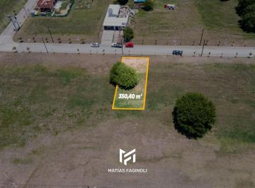 | Tejas 4, Malagueño | 350 m² | USD 31.500 | $90.00 | [Ver](https://www.zonaprop.com.ar/propiedades/clasificado/vecltrin-tejas-4-etapa-3-lote-central-cancelado-57925024.html?n_src=Listado&n_pills=Encargado&n_pg=4&n_pos=14) |
| 63 | 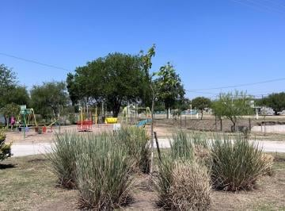 | Tejas 4, Malagueño | 350 m² | USD 32.000 | $91.43 | [Ver](https://www.zonaprop.com.ar/propiedades/clasificado/vecltrin-oportunidad-tejas-4-terreno-frente-a-plaza-etapa-3.-56586834.html?n_src=Listado&n_pills=Encargado&n_pg=4&n_pos=10) |
| 64 |  | Balcones del Este, Córdoba | 250 m² | USD 24.000 | $96.00 | [Ver](https://www.zonaprop.com.ar/propiedades/clasificado/vecltrin-lotes-venta-balcones-del-este-constructores-consulte-56517222.html?n_src=Listado&n_pills=Encargado&n_pg=5&n_pos=22) |
| 65 | 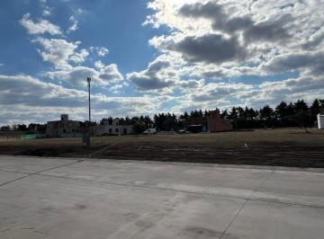 | Talar del Este, Mendiolaza | 360 m² | USD 34.850 | $96.81 | [Ver](https://www.zonaprop.com.ar/propiedades/clasificado/vecltrin--oportunidad-unica!-lotes-talar-del-este!-sobre-ruta-53276201.html?n_src=Listado&n_pg=5&n_pos=24) |
| 66 |  | Estancia Q2, Mendiolaza | 1,594 m² | USD 156.000 | $97.87 | [Ver](https://www.zonaprop.com.ar/propiedades/clasificado/vecltrin-maxima-privacidad-imponente-lote-de-1.594-m-sup2--en-51555095.html?n_src=Listado&n_pills=Terraza&n_pg=1&n_pos=28) |
| 67 | 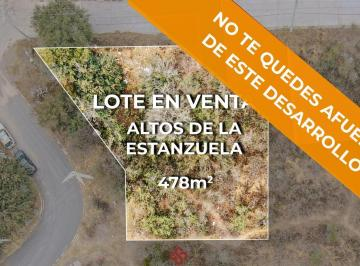 | Terrazas de La Estanzuela, La Calera | 478 m² | USD 49.900 | $104.39 | [Ver](https://www.zonaprop.com.ar/propiedades/clasificado/vecltrin-terreno-en-venta-listo-para-escriturar-altos-de-la-57821467.html?n_src=Listado&n_pills=Encargado&n_pg=3&n_pos=9) |
| 68 |  | San Alfonso del Talar, Mendiolaza | 630 m² | USD 70.000 | $111.11 | [Ver](https://www.zonaprop.com.ar/propiedades/clasificado/vecltrin--venta!-lote-en-san-alfonso-del-talar!-con-56084725.html?n_src=Listado&n_pg=5&n_pos=15) |
| 69 | 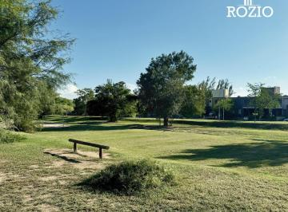 | Córdoba, Córdoba | 360 m² | USD 44.000 | $122.22 | [Ver](https://www.zonaprop.com.ar/propiedades/clasificado/vecltrin-terreno-en-venta-en-barrio-la-catalina-360-m-sup2-58195045.html?n_src=Listado&n_pills=Encargado&n_pg=2&n_pos=19) |
| 70 | 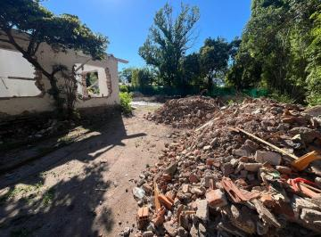 | Villa Allende, Villa Allende | 650 m² | USD 80.000 | $123.08 | [Ver](https://www.zonaprop.com.ar/propiedades/clasificado/vecltrin-oportunidad-de-terreno-a-desarrollar-57916110.html?n_src=Listado&n_pg=3&n_pos=11) |
| 71 | 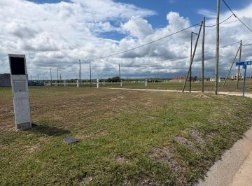 | Malagueño, Córdoba | 275 m² | USD 34.000 | $123.64 | [Ver](https://www.zonaprop.com.ar/propiedades/clasificado/vecltrin-venta-terreno-en-docta-central-58434258.html?n_src=Listado&n_pills=Encargado&n_pg=4&n_pos=27) |
| 72 |  | Docta Central, DOCTA | 262 m² | USD 32.500 | $124.05 | [Ver](https://www.zonaprop.com.ar/propiedades/clasificado/vecltrin-lote-262.5-m-sup2--docta-central-etapa-1-58276783.html?n_src=Listado&n_pg=4&n_pos=1) |
| 73 |  | Villa Allende, Córdoba | 31,624 m² | USD 4.111.120 | $130.00 | [Ver](https://www.zonaprop.com.ar/propiedades/clasificado/vecltrin-terreno-en-corredor-lucchese-55212128.html?n_src=Listado&n_pills=Apto+cr%C3%A9dito&n_pg=1&n_pos=6) |
| 74 |  | Villa Allende, Córdoba | 31,624 m² | USD 4.111.120 | $130.00 | [Ver](https://www.zonaprop.com.ar/propiedades/clasificado/vecltrin-terreno-en-corredor-lucchese-55212128.html?n_src=Listado&n_pills=Apto+cr%C3%A9dito&n_pg=3&n_pos=26) |
| 75 |  | La Cuesta, Villa Carlos Paz | 1,212 m² | USD 159.000 | $131.19 | [Ver](https://www.zonaprop.com.ar/propiedades/clasificado/vecltrin-terreno-en-venta-en-villa-carlos-paz-54503261.html?n_src=Listado&n_pg=5&n_pos=23) |
| 76 |  | Docta Central, DOCTA | 294 m² | USD 39.000 | $132.65 | [Ver](https://www.zonaprop.com.ar/propiedades/clasificado/vecltrin-lote-294-m-sup2--docta-central-58128856.html?n_src=Listado&n_pg=2&n_pos=10) |
| 77 |  | Manantiales, Córdoba | 338 m² | $ 45.000 | $133.14 | [Ver](https://www.zonaprop.com.ar/propiedades/clasificado/vecltrin-venta-lote-terreno-338-m-sup2--campos-de-manantiales-58450809.html?n_src=Listado&n_pills=Encargado&n_pg=3&n_pos=30) |
| 78 |  | Estancia Q2, Mendiolaza | 1,050 m² | USD 141.000 | $134.29 | [Ver](https://www.zonaprop.com.ar/propiedades/clasificado/vecltrin-frente-a-espacio-verde-lote-de-1.050-m-sup2--en-zona-51554965.html?n_src=Listado&n_pills=Pileta&n_pg=5&n_pos=4) |
| 79 |  | DOCTA, Córdoba | 360 m² | USD 48.500 | $134.72 | [Ver](https://www.zonaprop.com.ar/propiedades/clasificado/vecltrin-vendo-terreno-en-docta-senda-57794450.html?n_src=Listado&n_pills=Encargado&n_pg=1&n_pos=11) |
| 80 |  | Docta Avenida, DOCTA | 618 m² | USD 85.000 | $137.54 | [Ver](https://www.zonaprop.com.ar/propiedades/clasificado/vecltrin-lote-de-618-m-sup2--frente-a-espacio-verde!-docta-av-57908364.html?n_src=Listado&n_pg=2&n_pos=6) |
| 81 |  | DOCTA, Córdoba | 250 m² | USD 34.500 | $138.00 | [Ver](https://www.zonaprop.com.ar/propiedades/clasificado/vecltrin-terreno-en-venta-docta-central-58436327.html?n_src=Listado&n_pg=5&n_pos=9) |
| 82 |  | Docta Central, DOCTA | 260 m² | USD 36.000 | $138.46 | [Ver](https://www.zonaprop.com.ar/propiedades/clasificado/vecltrin-lote-docta-venta-posesion-fines-2025-57987894.html?n_src=Listado&n_pills=Encargado&n_pg=3&n_pos=12) |
| 83 |  | Campos de Manantiales, Córdoba | 338 m² | USD 47.000 | $139.05 | [Ver](https://www.zonaprop.com.ar/propiedades/clasificado/vecltrin--venta!-lote-en-campos-de-manantiales-apto-duplex!-57663500.html?n_src=Listado&n_pg=5&n_pos=27) |
| 84 |  | DOCTA, Córdoba | 250 m² | USD 35.000 | $140.00 | [Ver](https://www.zonaprop.com.ar/propiedades/clasificado/vecltrin-excelente-lote-en-docta-central-entrega-en-diciembre-56654668.html?n_src=Listado&n_pills=Encargado&n_pg=5&n_pos=16) |
| 85 |  | Las Cañitas Barrio Privado, Malagueño | 525 m² | USD 74.000 | $140.95 | [Ver](https://www.zonaprop.com.ar/propiedades/clasificado/vecltrin-terreno-en-venta-en-malagueno-listo-para-construir-58075634.html?n_src=Listado&n_pills=Quincho&n_pg=2&n_pos=9) |
| 86 |  | Maitenes de La Deseada, La Calera | 453 m² | USD 64.000 | $141.28 | [Ver](https://www.zonaprop.com.ar/propiedades/clasificado/vecltrin--venta!-lote-en-maitenes-de-la-deseada-ubicacion-57345197.html?n_src=Listado&n_pg=2&n_pos=1) |
| 87 |  | Los Molinos, Córdoba | 4,357 m² | USD 619.000 | $142.07 | [Ver](https://www.zonaprop.com.ar/propiedades/clasificado/vecltrin-terreno-en-venta-con-vista-al-dique-los-molinos-57709094.html?n_src=Listado&n_pg=3&n_pos=7) |
| 88 |  | Docta Central, DOCTA | 250 m² | USD 36.500 | $146.00 | [Ver](https://www.zonaprop.com.ar/propiedades/clasificado/vecltrin-dos-lotes-contiguos-en-venta-docta-central-appto.-58010542.html?n_src=Listado&n_pills=Encargado&n_pg=1&n_pos=21) |
| 89 |  | Cuestas de Manantiales, Córdoba | 287 m² | USD 42.000 | $146.34 | [Ver](https://www.zonaprop.com.ar/propiedades/clasificado/vecltrin-terreno-en-venta-cuestas-de-manantiales-ii-lote-35-58389014.html?n_src=Listado&n_pg=4&n_pos=20) |
| 90 |  | Manantiales, Córdoba | 300 m² | USD 44.000 | $146.67 | [Ver](https://www.zonaprop.com.ar/propiedades/clasificado/vecltrin-vdo-lote-residencial-en-campos-de-manantiales-300-m-57071001.html?n_src=Listado&n_pills=Encargado&n_pg=4&n_pos=17) |
| 91 |  | Chacras de la Villa, Villa Allende | 1,000 m² | USD 149.400 | $149.40 | [Ver](https://www.zonaprop.com.ar/propiedades/clasificado/vecltrin-lotes-a-la-venta-en-chacras-de-la-villa-57868107.html?n_src=Listado&n_pills=Encargado&n_pg=3&n_pos=16) |
| 92 |  | Manantiales, Córdoba | 387 m² | USD 58.000 | $149.87 | [Ver](https://www.zonaprop.com.ar/propiedades/clasificado/vecltrin-lote-en-venta-en-barrio-pampas-de-manantiales.-57108269.html?n_src=Listado&n_pills=Encargado&n_pg=2&n_pos=2) |
| 93 |  | Las Cañitas Barrio Privado, Malagueño | 560 m² | USD 85.000 | $151.79 | [Ver](https://www.zonaprop.com.ar/propiedades/clasificado/vecltrin-terreno-en-venta-en-malagueno-listo-para-construir-57609425.html?n_src=Listado&n_pills=Quincho&n_pg=1&n_pos=5) |
| 94 |  | Manantiales, Córdoba | 250 m² | USD 38.000 | $152.00 | [Ver](https://www.zonaprop.com.ar/propiedades/clasificado/vecltrin-lote-250-m-sup2--cuestas-de-manantiales-58377577.html?n_src=Listado&n_pg=4&n_pos=12) |
| 95 |  | Manantiales, Córdoba | 350 m² | USD 55.000 | $157.14 | [Ver](https://www.zonaprop.com.ar/propiedades/clasificado/vecltrin-lote-apto-duplex-350-m-sup2--pampas-de-manantiales-58155198.html?n_src=Listado&n_pg=4&n_pos=29) |
| 96 |  | Manantiales, Córdoba | 250 m² | USD 39.500 | $158.00 | [Ver](https://www.zonaprop.com.ar/propiedades/clasificado/vecltrin-lote-en-venta-250-m-sup2--cuestas-de-manantiales-57564796.html?n_src=Listado&n_pills=Encargado&n_pg=5&n_pos=7) |
| 97 |  | Estancia El Terrón, Mendiolaza | 1,097 m² | USD 175.000 | $159.53 | [Ver](https://www.zonaprop.com.ar/propiedades/clasificado/vecltrin-lote-central-en-venta-en-estancia-el-terron.-57195736.html?n_src=Listado&n_pills=Encargado&n_pg=4&n_pos=24) |
| 98 |  | Manantiales, Córdoba | 272 m² | USD 43.500 | $159.93 | [Ver](https://www.zonaprop.com.ar/propiedades/clasificado/vecltrin-lotes-270-m-sup2--abras-de-manantiales-58155278.html?n_src=Listado&n_pg=4&n_pos=28) |
| 99 |  | Manantiales, Córdoba | 300 m² | USD 49.000 | $163.33 | [Ver](https://www.zonaprop.com.ar/propiedades/clasificado/vecltrin-venta.-abras-de-manantiales.-lotes-contiguos-apto-56615799.html?n_src=Listado&n_pills=Encargado&n_pg=5&n_pos=29) |
| 100 |  | Docta Parque, DOCTA | 360 m² | USD 59.000 | $163.89 | [Ver](https://www.zonaprop.com.ar/propiedades/clasificado/vecltrin-lote-docta-parque-57822462.html?n_src=Listado&n_pills=Encargado&n_pg=4&n_pos=25) |
| 101 |  | La Calera, Córdoba | 451 m² | USD 74.000 | $164.08 | [Ver](https://www.zonaprop.com.ar/propiedades/clasificado/vecltrin-venta-terreno-en-colinas-de-la-deseada-la-calera-56655261.html?n_src=Listado&n_pills=Encargado&n_pg=1&n_pos=16) |
| 102 |  | Las Cañitas Barrio Privado, Malagueño | 414 m² | USD 69.000 | $166.67 | [Ver](https://www.zonaprop.com.ar/propiedades/clasificado/vecltrin-terreno-en-venta-en-las-canitas-barrio-privado-listo-58062617.html?n_src=Listado&n_pills=Quincho&n_pg=2&n_pos=5) |
| 103 |  | Docta Avenida, DOCTA | 360 m² | USD 60.000 | $166.67 | [Ver](https://www.zonaprop.com.ar/propiedades/clasificado/vecltrin-docta-lote-en-venta-etapa-av-57413435.html?n_src=Listado&n_pg=2&n_pos=29) |
| 104 |  | Las Cañitas Barrio Privado, Malagueño | 450 m² | USD 75.000 | $166.67 | [Ver](https://www.zonaprop.com.ar/propiedades/clasificado/vecltrin-terrenoterreno-en-venta-en-malagueno-listo-para-58075606.html?n_src=Listado&n_pills=Quincho&n_pg=3&n_pos=4) |
| 105 |  | Pampas de Manantiales, Córdoba | 350 m² | USD 59.000 | $168.57 | [Ver](https://www.zonaprop.com.ar/propiedades/clasificado/vecltrin-venta-deterreno-apto-duplex-en-pampas-de-manantiales-56594116.html?n_src=Listado&n_pg=3&n_pos=15) |
| 106 |  | San Isidro, Villa Allende | 1,050 m² | USD 180.000 | $171.43 | [Ver](https://www.zonaprop.com.ar/propiedades/clasificado/vecltrin-terreno-1050-m-sup2--san-isidro-57883474.html?n_src=Listado&n_pills=Encargado&n_pg=1&n_pos=25) |
| 107 |  | Cuestas de Manantiales, Córdoba | 250 m² | USD 43.000 | $172.00 | [Ver](https://www.zonaprop.com.ar/propiedades/clasificado/vecltrin--venta!-lote-en-cuestas-de-manantiales-apto-duplex!-57647973.html?n_src=Listado&n_pg=2&n_pos=7) |
| 108 |  | Docta Avenida, DOCTA | 360 m² | USD 62.000 | $172.22 | [Ver](https://www.zonaprop.com.ar/propiedades/clasificado/vecltrin-venta.-docta-av-lote-apto-duplex-360-58267051.html?n_src=Listado&n_pills=Encargado&n_pg=3&n_pos=28) |
| 109 |  | Comarca de Allende, Córdoba | 360 m² | USD 62.000 | $172.22 | [Ver](https://www.zonaprop.com.ar/propiedades/clasificado/vecltrin-lote-a-la-venta-en-barrio-comarca-de-allende-57313639.html?n_src=Listado&n_pills=Terraza&n_pg=5&n_pos=13) |
| 110 |  | Docta Boulevard, DOCTA | 360 m² | USD 62.100 | $172.50 | [Ver](https://www.zonaprop.com.ar/propiedades/clasificado/vecltrin-docta-lotes-en-venta-etapas-1-2-3-4-posesion-55875946.html?n_src=Listado&n_pills=Encargado&n_pg=1&n_pos=9) |
| 111 |  | La Cascada Country Golf, Córdoba | 1,500 m² | USD 260.000 | $173.33 | [Ver](https://www.zonaprop.com.ar/propiedades/clasificado/vecltrin-vdo-lote-interno-en-la-cascada-country-golf-1500-m-57615401.html?n_src=Listado&n_pills=Encargado&n_pg=2&n_pos=30) |
| 112 |  | Estancia El Terrón, Mendiolaza | 1,460 m² | USD 257.000 | $176.03 | [Ver](https://www.zonaprop.com.ar/propiedades/clasificado/vecltrin-lote-fondo-golf-en-estancia-el-terron-51458335.html?n_src=Listado&n_pills=SUM&n_pg=1&n_pos=13) |
| 113 |  | Córdoba, Córdoba | 261 m² | USD 46.000 | $176.25 | [Ver](https://www.zonaprop.com.ar/propiedades/clasificado/vecltrin-terreno-en-venta-en-abras-de-manantiales.-apto-57090154.html?n_src=Listado&n_pills=Encargado&n_pg=3&n_pos=13) |
| 114 |  | Nobu Town, Córdoba | 360 m² | USD 65.000 | $180.56 | [Ver](https://www.zonaprop.com.ar/propiedades/clasificado/vecltrin-lote-360-m-sup2--nobu-town-57696207.html?n_src=Listado&n_pg=1&n_pos=2) |
| 115 |  | Docta Avenida, DOCTA | 360 m² | USD 65.000 | $180.56 | [Ver](https://www.zonaprop.com.ar/propiedades/clasificado/vecltrin-docta-lote-etapa-boulevard-gastos-pagos-57413794.html?n_src=Listado&n_pg=1&n_pos=14) |
| 116 |  | Güemes, Córdoba | 1,622 m² | USD 298.000 | $183.72 | [Ver](https://www.zonaprop.com.ar/propiedades/clasificado/vecltrin-terreno-en-guemes-lote-proyecto-aprobado-28-58226839.html?n_src=Listado&n_pills=SUM&n_pg=5&n_pos=2) |
| 117 |  | San Ignacio Village, Córdoba | 393 m² | USD 72.500 | $184.48 | [Ver](https://www.zonaprop.com.ar/propiedades/clasificado/vecltrin-oportunidad-manantiales-ii-393-m-sup2-!-terreno-52553728.html?n_src=Listado&n_pills=Encargado&n_pg=2&n_pos=21) |
| 118 |  | Solares de Manantiales, Córdoba | 460 m² | USD 85.000 | $184.78 | [Ver](https://www.zonaprop.com.ar/propiedades/clasificado/vecltrin-lote-residencial-en-barrio-solares-de-manantiales-58444815.html?n_src=Listado&n_pills=Encargado&n_pg=1&n_pos=29) |
| 119 |  | San Lorenzo, Córdoba | 630 m² | USD 120.000 | $190.48 | [Ver](https://www.zonaprop.com.ar/propiedades/clasificado/vecltrin-terreno-en-venta-630-m-sup2--av-sabattini-zona-56630044.html?n_src=Listado&n_pg=1&n_pos=19) |
| 120 |  | La Calera, Córdoba | 1,129 m² | USD 220.000 | $194.86 | [Ver](https://www.zonaprop.com.ar/propiedades/clasificado/vecltrin--venta!-lote-en-la-rufina-con-pendiente-positiva!-con-57225203.html?n_src=Listado&n_pg=5&n_pos=8) |
| 121 |  | Manantiales, Córdoba | 250 m² | USD 50.000 | $200.00 | [Ver](https://www.zonaprop.com.ar/propiedades/clasificado/vecltrin-abras-de-manantiales-lotes-centrales-con-entorno-57956390.html?n_src=Listado&n_pg=1&n_pos=24) |
| 122 |  | Docta Avenida, DOCTA | 250 m² | USD 51.500 | $206.00 | [Ver](https://www.zonaprop.com.ar/propiedades/clasificado/vecltrin-lote-en-venta-en-docta-etapa-boulevard-malagueno-57413651.html?n_src=Listado&n_pg=5&n_pos=17) |
| 123 |  | Nuevo Malagueño, Malagueño | 265 m² | USD 55.000 | $207.55 | [Ver](https://www.zonaprop.com.ar/propiedades/clasificado/vecltrin-terreno-en-venta-en-nuevo-malagueno-de-265-m-sup2-58161646.html?n_src=Listado&n_pills=Encargado&n_pg=4&n_pos=3) |
| 124 |  | Malagueño, Malagueño | 3,028 m² | USD 636.000 | $210.04 | [Ver](https://www.zonaprop.com.ar/propiedades/clasificado/vecltrin-lotes-de-uso-mixto-desde-3.028-m-sup2--nuevo-53905826.html?n_src=Listado&n_pg=3&n_pos=3) |
| 125 |  | Los Boulevares, Córdoba | 380 m² | USD 80.000 | $210.53 | [Ver](https://www.zonaprop.com.ar/propiedades/clasificado/vecltrin-lote-apto-duplex-barrio-cerrado-57821915.html?n_src=Listado&n_pg=5&n_pos=19) |
| 126 |  | Siete Soles Naturaleza Urbana, Córdoba | 600 m² | USD 130.000 | $216.67 | [Ver](https://www.zonaprop.com.ar/propiedades/clasificado/vecltrin-terreno-siete-soles-57986676.html?n_src=Listado&n_pills=Encargado&n_pg=2&n_pos=8) |
| 127 |  | Las Cañitas Barrio Privado, Malagueño | 300 m² | USD 65.000 | $216.67 | [Ver](https://www.zonaprop.com.ar/propiedades/clasificado/vecltrin-terreno-en-venta-en-malagueno-listo-para-construir-58075628.html?n_src=Listado&n_pills=SUM&n_pg=4&n_pos=23) |
| 128 |  | Distrito Sur, Córdoba | 360 m² | USD 79.000 | $219.44 | [Ver](https://www.zonaprop.com.ar/propiedades/clasificado/vecltrin-lote-360-m-sup2--distrito-sur-57345315.html?n_src=Listado&n_pg=5&n_pos=10) |
| 129 |  | Distrito Sur, Córdoba | 360 m² | USD 79.000 | $219.44 | [Ver](https://www.zonaprop.com.ar/propiedades/clasificado/vecltrin-lote-a-la-venta-b-distrito-sur-zona-residencial-57825538.html?n_src=Listado&n_pg=5&n_pos=20) |
| 130 |  | Malagueño, Córdoba | 250 m² | USD 55.000 | $220.00 | [Ver](https://www.zonaprop.com.ar/propiedades/clasificado/vecltrin-terreno-en-venta-en-nuevo-malagueno-57249128.html?n_src=Listado&n_pills=Encargado&n_pg=5&n_pos=18) |
| 131 |  | Acquavista, Malagueño | 303 m² | USD 70.000 | $231.02 | [Ver](https://www.zonaprop.com.ar/propiedades/clasificado/vecltrin-lote-en-venta-303-mtrs.2-apto-duplex-acquavista-58292918.html?n_src=Listado&n_pg=5&n_pos=11) |
| 132 |  | Lomas de la Carolina, Córdoba | 1,506 m² | USD 350.000 | $232.40 | [Ver](https://www.zonaprop.com.ar/propiedades/clasificado/vecltrin-casa-en-lomas-de-la-carolina-56867525.html?n_src=Listado&n_pills=Dormitorio+en+suite&n_pg=4&n_pos=8) |
| 133 |  | Las Delicias, Córdoba | 1,886 m² | USD 450.000 | $238.60 | [Ver](https://www.zonaprop.com.ar/propiedades/clasificado/vecltrin-lote-esquina-en-venta-en-las-delicias-58076764.html?n_src=Listado&n_pills=Pileta&n_pg=1&n_pos=10) |
| 134 |  | Docta Avenida, DOCTA | 360 m² | USD 88.000 | $244.44 | [Ver](https://www.zonaprop.com.ar/propiedades/clasificado/vecltrin-docta-parque-apto-comercio-57124866.html?n_src=Listado&n_pg=3&n_pos=21) |
| 135 |  | Costas de Manantiales, Córdoba | 420 m² | USD 105.000 | $250.00 | [Ver](https://www.zonaprop.com.ar/propiedades/clasificado/vecltrin--oportunidad-en-costas-de-manantiales!-420-m-posesion-57070991.html?n_src=Listado&n_pills=Encargado&n_pg=4&n_pos=9) |
| 136 |  | La Calandria, Córdoba | 360 m² | USD 95.000 | $263.89 | [Ver](https://www.zonaprop.com.ar/propiedades/clasificado/vecltrin-venta.-la-calandria.-lote-disponible.-apt.-duplex-54491303.html?n_src=Listado&n_pills=Encargado&n_pg=3&n_pos=17) |
| 137 |  | Tejas II, Córdoba | 254 m² | USD 70.000 | $275.59 | [Ver](https://www.zonaprop.com.ar/propiedades/clasificado/vecltrin-terreno-en-venta-en-jardin-de-las-tejas-de-254-m-sup2-57516016.html?n_src=Listado&n_pg=2&n_pos=3) |
| 138 |  | Solares de Manantiales, Córdoba | 305 m² | USD 85.000 | $278.69 | [Ver](https://www.zonaprop.com.ar/propiedades/clasificado/vecltrin-lotes-en-venta-en-solares-de-manantiales!-58140901.html?n_src=Listado&n_pills=Encargado&n_pg=3&n_pos=29) |
| 139 |  | Jardín Inglés, Valle Escondido | 800 m² | USD 235.000 | $293.75 | [Ver](https://www.zonaprop.com.ar/propiedades/clasificado/vecltrin-valle-escondido-lote-en-venta-en-jardin-ingles.-57821507.html?n_src=Listado&n_pills=Encargado&n_pg=5&n_pos=5) |
| 140 |  | Campo Chico Urbanización Residencial, Córdoba | 360 m² | USD 115.000 | $319.44 | [Ver](https://www.zonaprop.com.ar/propiedades/clasificado/vecltrin-venta.-campo-chico.-lote-apto-duplex-precio-55540428.html?n_src=Listado&n_pills=Encargado&n_pg=5&n_pos=26) |
| 141 |  | Mansos del Sur, Córdoba | 410 m² | USD 132.000 | $321.95 | [Ver](https://www.zonaprop.com.ar/propiedades/clasificado/vecltrin-lote-410-m-sup2--mansos-del-sur-56899407.html?n_src=Listado&n_pg=5&n_pos=14) |
| 142 |  | Greenville II, Córdoba | 364 m² | USD 118.000 | $324.18 | [Ver](https://www.zonaprop.com.ar/propiedades/clasificado/vecltrin-lotes-en-venta-en-greenville-3-apto-duplex-57872507.html?n_src=Listado&n_pills=Encargado&n_pg=1&n_pos=26) |
| 143 |  | Greenville II, Córdoba | 364 m² | USD 118.000 | $324.18 | [Ver](https://www.zonaprop.com.ar/propiedades/clasificado/vecltrin-lotes-en-venta-en-greenville-3-apto-duplex-57872507.html?n_src=Listado&n_pills=Encargado&n_pg=3&n_pos=23) |
| 144 |  | Güemes, Córdoba | 200 m² | USD 75.000 | $375.00 | [Ver](https://www.zonaprop.com.ar/propiedades/clasificado/vecltrin-terreno-en-venta-de-200-m-sup2--p-inversor-casa-a-53857279.html?n_src=Listado&n_pg=2&n_pos=26) |
| 145 |  | Nueva Córdoba, Córdoba | 635 m² | USD 300.000 | $472.44 | [Ver](https://www.zonaprop.com.ar/propiedades/clasificado/vecltrin-terreno-en-nueva-cordoba-55276770.html?n_src=Listado&n_pg=4&n_pos=11) |
| 146 |  | Centro, Córdoba | 358 m² | USD 200.000 | $558.66 | [Ver](https://www.zonaprop.com.ar/propiedades/clasificado/vecltrin-inmueble-apto-edificio-exc-ubicacion-385-m-sup2-57968824.html?n_src=Listado&n_pg=5&n_pos=12) |
| 147 |  | General Paz, Córdoba | 256 m² | USD 320.000 | $1,250.00 | [Ver](https://www.zonaprop.com.ar/propiedades/clasificado/vecltrin-general-paz-venta-lote-apto-21-unidades-escritura-57751712.html?n_src=Listado&n_pg=2&n_pos=15) |

---

*Reporte generado automáticamente. Precios y disponibilidad sujetos a cambios. Consultar en [ZonaProp](https://www.zonaprop.com.ar) para información actualizada.*
