# Terrenos en Venta en Córdoba

**Reporte de mercado** · 2026-02-28 22:58 · Fuente: [zonaprop.com.ar](https://www.zonaprop.com.ar/terrenos-venta-cordoba.html)

---

## Resumen del Mercado

- **Publicaciones analizadas:** 147
- **Rango de precios (USD):** $4,000 – $2,210,000
- **Precio promedio:** $107,604
- **Precio mediano:** $60,000
- **Superficie:** 108 m² – 53,000 m²
- **Superficie promedio:** 2,098 m²
- **Precio/m² promedio (USD):** $121.53
- **Precio/m² mediano (USD):** $93.65

## Distribución de Precios

```chart
{"type": "bar", "data": {"labels": ["< 25K", "25K–50K", "50K–75K", "75K–100K", "100K–150K", "150K–250K", "250K–500K", "500K+"], "datasets": [{"label": "Cantidad de terrenos", "data": [11, 43, 40, 13, 21, 11, 4, 3], "backgroundColor": "rgba(2, 116, 182, 0.75)", "borderColor": "rgba(2, 116, 182, 1)", "borderWidth": 1}]}, "options": {"plugins": {"title": {"display": true, "text": "Distribución de Precios (USD)"}}, "scales": {"y": {"beginAtZero": true, "title": {"display": true, "text": "Cantidad"}}, "x": {"title": {"display": true, "text": "Rango de precio"}}}}}
```

```chart
{"type": "bar", "data": {"labels": ["Colonia Caroya", "Corral de Barranca", "Barrio de Campo El Sereno", "La Falda", "San Antonio de Arredondo", "Monte Cristo", "Los Cocos", "Potrero de Garay", "Estancia Vieja", "Ascochinga", "San Roque", "Villa Giardino", "Río Ceballos", "Alta Gracia", "Estación del Carmen", "Santa María de Punilla", "Los Molinos", "Puerto del Águila Country", "Villa del Lago", "Río Segundo"], "datasets": [{"label": "Precio/m² promedio (USD)", "data": [3.21, 8.2, 10.81, 11.03, 11.71, 12.42, 12.5, 12.7, 15.15, 15.88, 16.33, 19.2, 21.63, 24.91, 31.29, 33.5, 38.33, 40.25, 42.51, 45.3], "backgroundColor": "rgba(34, 139, 34, 0.65)", "borderColor": "rgba(34, 139, 34, 1)", "borderWidth": 1}]}, "options": {"indexAxis": "y", "plugins": {"title": {"display": true, "text": "Precio/m² por Zona (más económicas primero)"}}, "scales": {"x": {"beginAtZero": true, "title": {"display": true, "text": "USD/m²"}}}}}
```

```chart
{"type": "scatter", "data": {"datasets": [{"label": "Superficie vs Precio", "data": [{"x": 513.0, "y": 35000}, {"x": 261.0, "y": 45000}, {"x": 256.0, "y": 67000}, {"x": 360.0, "y": 148000}, {"x": 495.0, "y": 25000}, {"x": 1292.0, "y": 52000}, {"x": 250.0, "y": 45000}, {"x": 250.0, "y": 63000}, {"x": 476.0, "y": 45000}, {"x": 2200.0, "y": 65000}, {"x": 635.0, "y": 300000}, {"x": 5244.0, "y": 43000}, {"x": 1500.0, "y": 130000}, {"x": 753.0, "y": 31000}, {"x": 360.0, "y": 42000}, {"x": 1247.0, "y": 105000}, {"x": 265.0, "y": 55000}, {"x": 3110.0, "y": 300000}, {"x": 2100.0, "y": 45000}, {"x": 1051.0, "y": 72620}, {"x": 415.0, "y": 198000}, {"x": 262.0, "y": 32500}, {"x": 1727.0, "y": 50000}, {"x": 360.0, "y": 33205}, {"x": 360.0, "y": 125000}, {"x": 350.0, "y": 56500}, {"x": 600.0, "y": 130000}, {"x": 1300.0, "y": 85000}, {"x": 250.0, "y": 35000}, {"x": 1065.0, "y": 79900}, {"x": 250.0, "y": 53000}, {"x": 461.0, "y": 8500}, {"x": 1050.0, "y": 180000}, {"x": 1000.0, "y": 149400}, {"x": 1048.0, "y": 48000}, {"x": 252.0, "y": 37000}, {"x": 2500.0, "y": 32000}, {"x": 1500.0, "y": 165000}, {"x": 261.0, "y": 45000}, {"x": 730.0, "y": 39000}, {"x": 322.0, "y": 4000}, {"x": 810.0, "y": 60000}, {"x": 250.0, "y": 15500}, {"x": 375.0, "y": 74400}, {"x": 303.0, "y": 70000}, {"x": 600.0, "y": 36000}, {"x": 364.0, "y": 65000}, {"x": 1500.0, "y": 85000}, {"x": 375.0, "y": 58000}, {"x": 266.0, "y": 35000}, {"x": 1516.0, "y": 210000}, {"x": 250.0, "y": 41000}, {"x": 260.0, "y": 11400}, {"x": 360.0, "y": 70000}, {"x": 266.0, "y": 40000}, {"x": 6560.0, "y": 29000}, {"x": 1038.0, "y": 100000}, {"x": 5000.0, "y": 50400}, {"x": 5032.0, "y": 35000}, {"x": 2500.0, "y": 187500}, {"x": 685.0, "y": 44000}, {"x": 1727.0, "y": 50000}, {"x": 503.0, "y": 140000}, {"x": 4187.0, "y": 98000}, {"x": 364.0, "y": 72167}, {"x": 250.0, "y": 52600}, {"x": 1868.0, "y": 20200}, {"x": 300.0, "y": 65000}, {"x": 265.0, "y": 55000}, {"x": 6150.0, "y": 72000}, {"x": 360.0, "y": 31800}, {"x": 360.0, "y": 70000}, {"x": 1450.0, "y": 70500}, {"x": 4179.0, "y": 70999}, {"x": 1192.0, "y": 54000}, {"x": 6000.0, "y": 130000}, {"x": 1046.0, "y": 35000}, {"x": 387.0, "y": 58000}, {"x": 600.0, "y": 125000}, {"x": 1737.0, "y": 301000}, {"x": 360.0, "y": 53000}, {"x": 1477.0, "y": 137000}, {"x": 1179.0, "y": 100000}, {"x": 445.0, "y": 20000}, {"x": 1594.0, "y": 156000}, {"x": 393.0, "y": 72500}, {"x": 250.0, "y": 34500}, {"x": 380.0, "y": 80000}, {"x": 252.0, "y": 42000}, {"x": 600.0, "y": 115000}, {"x": 272.0, "y": 43500}, {"x": 720.0, "y": 38000}, {"x": 360.0, "y": 54000}, {"x": 10000.0, "y": 210000}, {"x": 1219.0, "y": 134000}, {"x": 1397.0, "y": 90000}, {"x": 407.0, "y": 472500}, {"x": 709.0, "y": 35000}, {"x": 2870.0, "y": 110000}, {"x": 360.0, "y": 85750}, {"x": 1250.0, "y": 100000}, {"x": 2150.0, "y": 71000}, {"x": 1250.0, "y": 93750}, {"x": 950.0, "y": 17000}, {"x": 9900.0, "y": 119000}, {"x": 1230.0, "y": 90000}, {"x": 630.0, "y": 70000}, {"x": 598.0, "y": 75000}, {"x": 792.0, "y": 12000}, {"x": 262.0, "y": 33500}, {"x": 1032.0, "y": 50000}, {"x": 476.0, "y": 45000}, {"x": 1000.0, "y": 65000}, {"x": 800.0, "y": 235000}, {"x": 1000.0, "y": 89000}, {"x": 2000.0, "y": 25000}, {"x": 250.0, "y": 36500}, {"x": 783.0, "y": 54000}, {"x": 108.0, "y": 45000}, {"x": 500.0, "y": 27000}, {"x": 970.0, "y": 10700}, {"x": 560.0, "y": 92000}, {"x": 1000.0, "y": 17000}, {"x": 400.0, "y": 64000}, {"x": 1250.0, "y": 128000}, {"x": 350.0, "y": 58000}, {"x": 600.0, "y": 129900}, {"x": 525.0, "y": 65000}, {"x": 513.0, "y": 35000}, {"x": 900.0, "y": 45000}, {"x": 250.0, "y": 39500}, {"x": 1212.0, "y": 159000}, {"x": 2137.0, "y": 120000}, {"x": 1146.0, "y": 22000}, {"x": 300.0, "y": 25000}, {"x": 325.0, "y": 48500}, {"x": 1024.0, "y": 90000}, {"x": 287.0, "y": 39000}, {"x": 600.0, "y": 110000}, {"x": 800.0, "y": 60000}], "backgroundColor": "rgba(2, 116, 182, 0.5)", "pointRadius": 5}]}, "options": {"plugins": {"title": {"display": true, "text": "Relación Superficie vs Precio (< 500K USD, < 15.000 m²)"}}, "scales": {"x": {"title": {"display": true, "text": "Superficie (m²)"}}, "y": {"title": {"display": true, "text": "Precio (USD)"}, "beginAtZero": true}}}}
```

---

## Rankings

### Mejor Relación Calidad-Precio

> Score compuesto: 65% precio/m² + 35% tamaño óptimo (~2.000 m²)

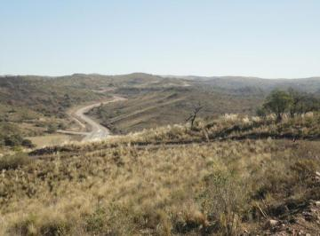

**#1** — **Río Ceballos, Córdoba**

- **Precio:** USD 59.000
- **Superficie:** 22,250 m²
- **Precio/m²:** USD 2.65/m²
- Lopez baena te ofrece: -Lote de 22. 250 m2 en el hermoso Potrero del alto. Servicios: luz Y agua*posee escritura* otras 
- [Ver publicación](https://www.zonaprop.com.ar/propiedades/clasificado/vecltrin-oportunidad!-vendo-22.250-m-sup2--a-usd-59.000-en-58220070.html?n_src=Listado&n_pg=2&n_pos=11)

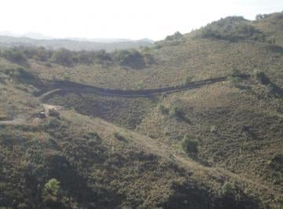

**#2** — **Río Ceballos, Córdoba**

- **Precio:** USD 29.000
- **Superficie:** 6,560 m²
- **Precio/m²:** USD 4.42/m²
- Lopez baena te ofrece: Lotes desde 6600 a 12. 000 m2 en el hermoso Potrero del altos. potrero del alto: se ubica en un e
- [Ver publicación](https://www.zonaprop.com.ar/propiedades/clasificado/vecltrin-imperdibles!-vendo-lotes-desde-6600-m-sup2--camino-del-58220063.html?n_src=Listado&n_pg=3&n_pos=4)

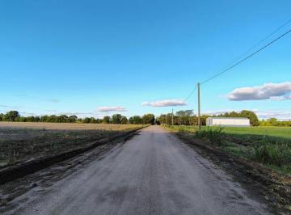

**#3** — **Colonia Caroya, Córdoba**

- **Precio:** USD 170.000
- **Superficie:** 53,000 m²
- **Precio/m²:** USD 3.21/m²
- Grupo norte vende. ¡gran oportunidad! Gran lote de 53. 000 M² ideal para siembra O desarrollo productivo. Ubicado en un 
- [Ver publicación](https://www.zonaprop.com.ar/propiedades/clasificado/vecltrin-venta-campo-de-5-3-ha-ideal-para-producir-56901548.html?n_src=Listado&n_pg=5&n_pos=12)


**#4** — **Potrero de Garay, Córdoba**

- **Precio:** USD 35.000
- **Superficie:** 5,032 m²
- **Precio/m²:** USD 6.96/m²
- Lote en venta en estancia la cunka potrero de garaylote 39 etapa 2, De facil acceso con cualquier vehiculo, a metros del
- [Ver publicación](https://www.zonaprop.com.ar/propiedades/clasificado/vecltrin-terreno-en-venta-sierras-de-cordoba-potrero-de-garay-58126335.html?n_src=Listado&n_pills=Terraza&n_pg=3&n_pos=7)

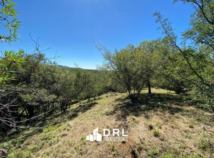

**#5** — **Corral de Barranca, Unquillo**

- **Precio:** USD 43.000
- **Superficie:** 5,244 m²
- **Precio/m²:** USD 8.20/m²
- Lote en VentaCorral de Barrancas - Unquillo5244m2Lote en venta, ubicado en Corral de Barrancas, Unquillo. Inmejorable ub
- [Ver publicación](https://www.zonaprop.com.ar/propiedades/clasificado/vecltrin-terreno-en-venta-en-corral-de-barranca-57324159.html?n_src=Listado&n_pg=1&n_pos=15)

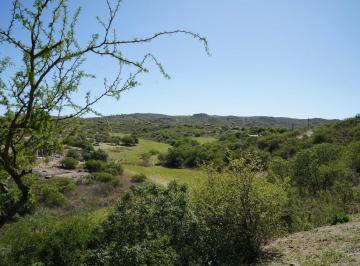

**#6** — **Ascochinga, Córdoba**

- **Precio:** USD 50.400
- **Superficie:** 5,000 m²
- **Precio/m²:** USD 10.08/m²
- Lotes de 5. 000 m² en El Buen Aire Viví rodeado de naturaleza. En un rincón único entre Ascochinga y la Estancia Jesuíti
- [Ver publicación](https://www.zonaprop.com.ar/propiedades/clasificado/vecltrin-terrenos-en-venta-de-5000-m-sup2--en-el-buen-aire-57412066.html?n_src=Listado&n_pills=Encargado&n_pg=3&n_pos=6)

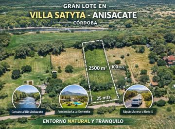

**#7** — **Alta Gracia, Córdoba**

- **Precio:** USD 32.000
- **Superficie:** 2,500 m²
- **Precio/m²:** USD 12.80/m²
- ¡atención! Lote escriturado de 2. 500 m² en anisacate oportunidad única con potencial de valorización. Ubicación estraté
- [Ver publicación](https://www.zonaprop.com.ar/propiedades/clasificado/vecltrin-venta-de-lote-en-anisacate-con-apto-credito-58030072.html?n_src=Listado&n_pills=Apto+cr%C3%A9dito&n_pg=2&n_pos=13)

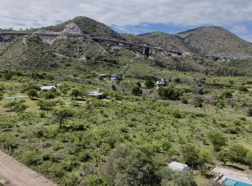

**#8** — **San Antonio de Arredondo, Córdoba**

- **Precio:** USD 72.000
- **Superficie:** 6,150 m²
- **Precio/m²:** USD 11.71/m²
- Oportunidades Inmobiliarias vende un espectacular terreno en Las Jarillas, rodeado de montañas y con una vista 360° únic
- [Ver publicación](https://www.zonaprop.com.ar/propiedades/clasificado/vecltrin-terreno-en-san-antonio-de-arredondo-57107854.html?n_src=Listado&n_pg=3&n_pos=18)

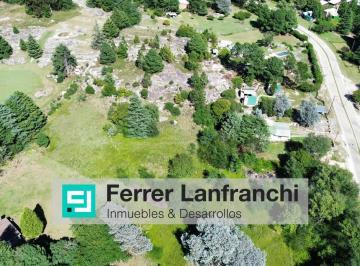

**#9** — **Santa María, Córdoba**

- **Precio:** USD 119.000
- **Superficie:** 9,900 m²
- **Precio/m²:** USD 12.02/m²
- Ferrer lanfranchi inmuebles &amp;amp; desarrollos, Te propone tener muy en cuenta este lote. Muy bien ubicado. 9900 M2 e
- [Ver publicación](https://www.zonaprop.com.ar/propiedades/clasificado/vecltrin-lote-en-venta-san-clemente-1-ha-oportunidad-57468325.html?n_src=Listado&n_pills=SUM&n_pg=4&n_pos=24)

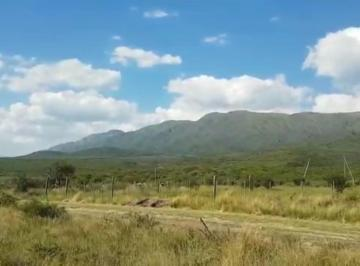

**#10** — **Los Cocos, Córdoba**

- **Precio:** USD 25.000
- **Superficie:** 2,000 m²
- **Precio/m²:** USD 12.50/m²
- Excelente oportunidad, ultimos 2 lotes! se vende los siguentes lotescon escrituraprecio en dolares. financiación hasta e
- [Ver publicación](https://www.zonaprop.com.ar/propiedades/clasificado/vecltrin-ultimos-2-lotes-!-los-cocos-b-jardin-financiacion-58220249.html?n_src=Listado&n_pg=5&n_pos=5)

---

### Más Económicos por m²


**#1** — **Río Ceballos, Córdoba**

- **Precio:** USD 59.000
- **Superficie:** 22,250 m²
- **Precio/m²:** USD 2.65/m²
- Lopez baena te ofrece: -Lote de 22. 250 m2 en el hermoso Potrero del alto. Servicios: luz Y agua*posee escritura* otras 
- [Ver publicación](https://www.zonaprop.com.ar/propiedades/clasificado/vecltrin-oportunidad!-vendo-22.250-m-sup2--a-usd-59.000-en-58220070.html?n_src=Listado&n_pg=2&n_pos=11)


**#2** — **Colonia Caroya, Córdoba**

- **Precio:** USD 170.000
- **Superficie:** 53,000 m²
- **Precio/m²:** USD 3.21/m²
- Grupo norte vende. ¡gran oportunidad! Gran lote de 53. 000 M² ideal para siembra O desarrollo productivo. Ubicado en un 
- [Ver publicación](https://www.zonaprop.com.ar/propiedades/clasificado/vecltrin-venta-campo-de-5-3-ha-ideal-para-producir-56901548.html?n_src=Listado&n_pg=5&n_pos=12)


**#3** — **Río Ceballos, Córdoba**

- **Precio:** USD 29.000
- **Superficie:** 6,560 m²
- **Precio/m²:** USD 4.42/m²
- Lopez baena te ofrece: Lotes desde 6600 a 12. 000 m2 en el hermoso Potrero del altos. potrero del alto: se ubica en un e
- [Ver publicación](https://www.zonaprop.com.ar/propiedades/clasificado/vecltrin-imperdibles!-vendo-lotes-desde-6600-m-sup2--camino-del-58220063.html?n_src=Listado&n_pg=3&n_pos=4)


**#4** — **Potrero de Garay, Córdoba**

- **Precio:** USD 35.000
- **Superficie:** 5,032 m²
- **Precio/m²:** USD 6.96/m²
- Lote en venta en estancia la cunka potrero de garaylote 39 etapa 2, De facil acceso con cualquier vehiculo, a metros del
- [Ver publicación](https://www.zonaprop.com.ar/propiedades/clasificado/vecltrin-terreno-en-venta-sierras-de-cordoba-potrero-de-garay-58126335.html?n_src=Listado&n_pills=Terraza&n_pg=3&n_pos=7)


**#5** — **Corral de Barranca, Unquillo**

- **Precio:** USD 43.000
- **Superficie:** 5,244 m²
- **Precio/m²:** USD 8.20/m²
- Lote en VentaCorral de Barrancas - Unquillo5244m2Lote en venta, ubicado en Corral de Barrancas, Unquillo. Inmejorable ub
- [Ver publicación](https://www.zonaprop.com.ar/propiedades/clasificado/vecltrin-terreno-en-venta-en-corral-de-barranca-57324159.html?n_src=Listado&n_pg=1&n_pos=15)


**#6** — **Ascochinga, Córdoba**

- **Precio:** USD 50.400
- **Superficie:** 5,000 m²
- **Precio/m²:** USD 10.08/m²
- Lotes de 5. 000 m² en El Buen Aire Viví rodeado de naturaleza. En un rincón único entre Ascochinga y la Estancia Jesuíti
- [Ver publicación](https://www.zonaprop.com.ar/propiedades/clasificado/vecltrin-terrenos-en-venta-de-5000-m-sup2--en-el-buen-aire-57412066.html?n_src=Listado&n_pills=Encargado&n_pg=3&n_pos=6)

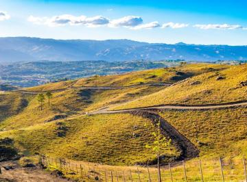

**#7** — **Barrio de Campo El Sereno, Villa Yacanto**

- **Precio:** USD 20.200
- **Superficie:** 1,868 m²
- **Precio/m²:** USD 10.81/m²
- Lote en venta en Barrio El Sereno, Yacanto. El Sereno, en zona de Yacanto, se encuentra en un entorno natural privilegia
- [Ver publicación](https://www.zonaprop.com.ar/propiedades/clasificado/vecltrin-terreno-en-venta-barrio-de-campo-el-sereno-yacanto-58413978.html?n_src=Listado&n_pg=3&n_pos=15)

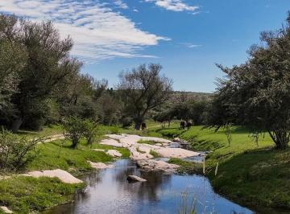

**#8** — **La Falda, Córdoba**

- **Precio:** USD 10.700
- **Superficie:** 970 m²
- **Precio/m²:** USD 11.03/m²
- Se vende terreno en club de campo los tres arroyos!! Club de Campo los Tres Arroyos un lugar donde la tranquilidad se co
- [Ver publicación](https://www.zonaprop.com.ar/propiedades/clasificado/vecltrin-venta-terreno-970-m-sup2--club-de-campo-los-tres-58041333.html?n_src=Listado&n_pg=5&n_pos=10)


**#9** — **San Antonio de Arredondo, Córdoba**

- **Precio:** USD 72.000
- **Superficie:** 6,150 m²
- **Precio/m²:** USD 11.71/m²
- Oportunidades Inmobiliarias vende un espectacular terreno en Las Jarillas, rodeado de montañas y con una vista 360° únic
- [Ver publicación](https://www.zonaprop.com.ar/propiedades/clasificado/vecltrin-terreno-en-san-antonio-de-arredondo-57107854.html?n_src=Listado&n_pg=3&n_pos=18)


**#10** — **Santa María, Córdoba**

- **Precio:** USD 119.000
- **Superficie:** 9,900 m²
- **Precio/m²:** USD 12.02/m²
- Ferrer lanfranchi inmuebles &amp;amp; desarrollos, Te propone tener muy en cuenta este lote. Muy bien ubicado. 9900 M2 e
- [Ver publicación](https://www.zonaprop.com.ar/propiedades/clasificado/vecltrin-lote-en-venta-san-clemente-1-ha-oportunidad-57468325.html?n_src=Listado&n_pills=SUM&n_pg=4&n_pos=24)

---

### Más Económicos (precio total)

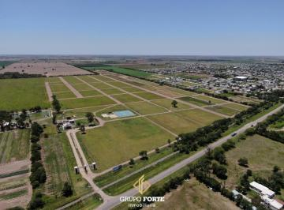

**#1** — **Monte Cristo, Córdoba**

- **Precio:** USD 4.000
- **Superficie:** 322 m²
- **Precio/m²:** USD 12.42/m²
- Gran Oportunidad en Monte Cristo "La Rochelle" Villa Exclusiva. - Lotes financiados. Un concepto de barrio privado de ca
- [Ver publicación](https://www.zonaprop.com.ar/propiedades/clasificado/vecltrin-oportunidad-lotes-la-rochelle-monte-cristo-58412660.html?n_src=Listado&n_pg=2&n_pos=17)

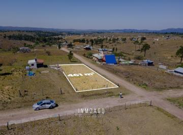

**#2** — **Potrero de Garay, Córdoba**

- **Precio:** USD 8.500
- **Superficie:** 461 m²
- **Precio/m²:** USD 18.44/m²
- Lote esquina con escritura en Pampa Alta – Potrero de Garay, una de las zonas con mayor crecimiento del valle, este terr
- [Ver publicación](https://www.zonaprop.com.ar/propiedades/clasificado/vecltrin-oportunidad-en-potrero-de-garay:-lote-esquina-con-57821917.html?n_src=Listado&n_pg=2&n_pos=7)


**#3** — **La Falda, Córdoba**

- **Precio:** USD 10.700
- **Superficie:** 970 m²
- **Precio/m²:** USD 11.03/m²
- Se vende terreno en club de campo los tres arroyos!! Club de Campo los Tres Arroyos un lugar donde la tranquilidad se co
- [Ver publicación](https://www.zonaprop.com.ar/propiedades/clasificado/vecltrin-venta-terreno-970-m-sup2--club-de-campo-los-tres-58041333.html?n_src=Listado&n_pg=5&n_pos=10)

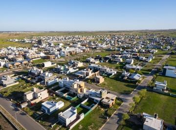

**#4** — **DOCTA, Córdoba**

- **Precio:** USD 11.400
- **Superficie:** 260 m²
- **Precio/m²:** USD 43.85/m²
- Tu oportunidad de inversión en docta Central 2! Ubicación estratégica dentro de la ciudad, con entrega pactada para el 2
- [Ver publicación](https://www.zonaprop.com.ar/propiedades/clasificado/vecltrin-lote-en-venta-financiado-docta-central-58136582.html?n_src=Listado&n_pg=2&n_pos=30)

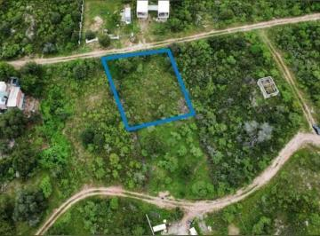

**#5** — **Estancia Vieja, Córdoba**

- **Precio:** USD 12.000
- **Superficie:** 792 m²
- **Precio/m²:** USD 15.15/m²
- En venta lote estancia vieja villa carlos paz zona El terreno se encuentra ubicado en la Comuna de Estancia Vieja, a poc
- [Ver publicación](https://www.zonaprop.com.ar/propiedades/clasificado/vecltrin-en-venta-lote-estancia-vieja-villa-carlos-paz-49593695.html?n_src=Listado&n_pg=4&n_pos=28)

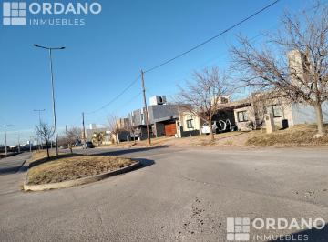

**#6** — **Córdoba, Córdoba**

- **Precio:** USD 15.500
- **Superficie:** 250 m²
- **Precio/m²:** USD 62.00/m²
- Ordano vende terrenos valle cercanovalle Cercano es un emprendimiento consolidado que se destaca en la oferta de terreno
- [Ver publicación](https://www.zonaprop.com.ar/propiedades/clasificado/vecltrin-terreno-en-valle-cercano-57948053.html?n_src=Listado&n_pills=Encargado&n_pg=2&n_pos=19)

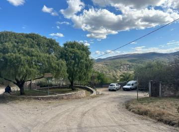

**#7** — **Río Ceballos, Córdoba**

- **Precio:** USD 17.000
- **Superficie:** 950 m²
- **Precio/m²:** USD 17.89/m²
- Disponibilidad de lotes en la lucinda- Loteo en Río Ceballos- Con doble acceso y una ubicación ideal. Sobre el camino de
- [Ver publicación](https://www.zonaprop.com.ar/propiedades/clasificado/vecltrin-terreno-en-venta-en-la-lucinda-rio-ceballos-cno-del-58141289.html?n_src=Listado&n_pg=4&n_pos=23)

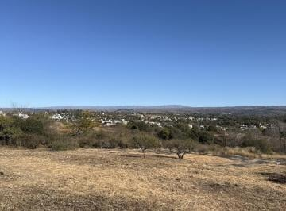

**#8** — **Santa María de Punilla, Córdoba**

- **Precio:** USD 17.000
- **Superficie:** 1,000 m²
- **Precio/m²:** USD 17.00/m²
- Terrenos en venta en Tanti Lomas con vista a Los GigantesOportunidades Inmobiliarias venden tres lotes contiguos en una 
- [Ver publicación](https://www.zonaprop.com.ar/propiedades/clasificado/vecltrin-terreno-en-tanti-lomas-57115202.html?n_src=Listado&n_pg=5&n_pos=13)

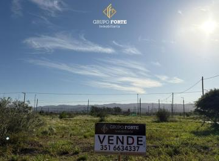

**#9** — **Alta Gracia, Córdoba**

- **Precio:** USD 20.000
- **Superficie:** 445 m²
- **Precio/m²:** USD 44.94/m²
- Terreno en venta con increíbles vistas en alta gracia. -Lote esquina en el Barrio Jardín Estancia Alta Gracia. -Tiene 45
- [Ver publicación](https://www.zonaprop.com.ar/propiedades/clasificado/vecltrin-terreno-en-venta-alta-gracia-57563510.html?n_src=Listado&n_pg=4&n_pos=3)


**#10** — **Barrio de Campo El Sereno, Villa Yacanto**

- **Precio:** USD 20.200
- **Superficie:** 1,868 m²
- **Precio/m²:** USD 10.81/m²
- Lote en venta en Barrio El Sereno, Yacanto. El Sereno, en zona de Yacanto, se encuentra en un entorno natural privilegia
- [Ver publicación](https://www.zonaprop.com.ar/propiedades/clasificado/vecltrin-terreno-en-venta-barrio-de-campo-el-sereno-yacanto-58413978.html?n_src=Listado&n_pg=3&n_pos=15)

---

### Terrenos Más Grandes


**#1** — **Colonia Caroya, Córdoba**

- **Precio:** USD 170.000
- **Superficie:** 53,000 m²
- **Precio/m²:** USD 3.21/m²
- Grupo norte vende. ¡gran oportunidad! Gran lote de 53. 000 M² ideal para siembra O desarrollo productivo. Ubicado en un 
- [Ver publicación](https://www.zonaprop.com.ar/propiedades/clasificado/vecltrin-venta-campo-de-5-3-ha-ideal-para-producir-56901548.html?n_src=Listado&n_pg=5&n_pos=12)

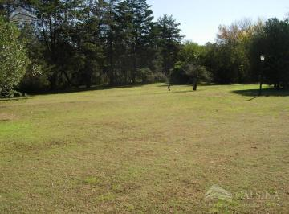

**#2** — **Villa Allende Golf, Villa Allende**

- **Precio:** USD 2.210.000
- **Superficie:** 34,000 m²
- **Precio/m²:** USD 65.00/m²
- Es una importantísima fracción de 34. 000 metros cuadrados, excelentemente ubicados sobre la Avenida Argentina, en el ba
- [Ver publicación](https://www.zonaprop.com.ar/propiedades/clasificado/vecltrin-terreno-en-venta-apto-housing-56234840.html?n_src=Listado&n_pills=Pileta&n_pg=2&n_pos=24)


**#3** — **Río Ceballos, Córdoba**

- **Precio:** USD 59.000
- **Superficie:** 22,250 m²
- **Precio/m²:** USD 2.65/m²
- Lopez baena te ofrece: -Lote de 22. 250 m2 en el hermoso Potrero del alto. Servicios: luz Y agua*posee escritura* otras 
- [Ver publicación](https://www.zonaprop.com.ar/propiedades/clasificado/vecltrin-oportunidad!-vendo-22.250-m-sup2--a-usd-59.000-en-58220070.html?n_src=Listado&n_pg=2&n_pos=11)

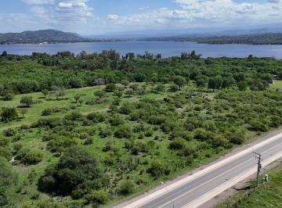

**#4** — **San Roque, Córdoba**

- **Precio:** USD 245.000
- **Superficie:** 15,000 m²
- **Precio/m²:** USD 16.33/m²
- Lote de 15. 000 M2 sobre avenida principal Imperdible lote ubicado en San Roque, a mil metros del Puente de la Sota. Cue
- [Ver publicación](https://www.zonaprop.com.ar/propiedades/clasificado/vecltrin-terreno-en-venta-en-san-roque-54534716.html?n_src=Listado&n_pills=SUM&n_pg=3&n_pos=3)

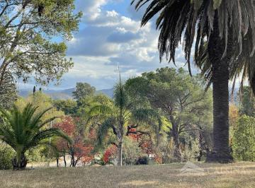

**#5** — **Villa Allende Golf, Villa Allende**

- **Precio:** USD 1.100.000
- **Superficie:** 11,262 m²
- **Precio/m²:** USD 97.67/m²
- Terreno de Ver datos m2 de superficie en la mejor zona de Villa Allende Golf, con espectaculares vistas. Se puede edific
- [Ver publicación](https://www.zonaprop.com.ar/propiedades/clasificado/vecltrin-terreno-en-venta-para-housing-en-villa-allende-golf-54179482.html?n_src=Listado&n_pills=Apto+cr%C3%A9dito&n_pg=2&n_pos=6)

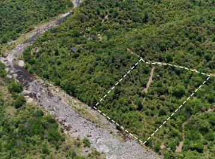

**#6** — **Santa Rosa de Calamuchita, Córdoba**

- **Precio:** USD 210.000
- **Superficie:** 10,000 m²
- **Precio/m²:** USD 21.00/m²
- Inmobiliaria Costamagna Ofrece a la venta estos terrenos en Santa Monica Calamuchita. Terrenos desde 1 hectárea con cost
- [Ver publicación](https://www.zonaprop.com.ar/propiedades/clasificado/vecltrin-terreno-en-venta-al-lado-del-rio-calamuchita-58158844.html?n_src=Listado&n_pg=4&n_pos=13)


**#7** — **Santa María, Córdoba**

- **Precio:** USD 119.000
- **Superficie:** 9,900 m²
- **Precio/m²:** USD 12.02/m²
- Ferrer lanfranchi inmuebles &amp;amp; desarrollos, Te propone tener muy en cuenta este lote. Muy bien ubicado. 9900 M2 e
- [Ver publicación](https://www.zonaprop.com.ar/propiedades/clasificado/vecltrin-lote-en-venta-san-clemente-1-ha-oportunidad-57468325.html?n_src=Listado&n_pills=SUM&n_pg=4&n_pos=24)


**#8** — **Río Ceballos, Córdoba**

- **Precio:** USD 29.000
- **Superficie:** 6,560 m²
- **Precio/m²:** USD 4.42/m²
- Lopez baena te ofrece: Lotes desde 6600 a 12. 000 m2 en el hermoso Potrero del altos. potrero del alto: se ubica en un e
- [Ver publicación](https://www.zonaprop.com.ar/propiedades/clasificado/vecltrin-imperdibles!-vendo-lotes-desde-6600-m-sup2--camino-del-58220063.html?n_src=Listado&n_pg=3&n_pos=4)


**#9** — **San Antonio de Arredondo, Córdoba**

- **Precio:** USD 72.000
- **Superficie:** 6,150 m²
- **Precio/m²:** USD 11.71/m²
- Oportunidades Inmobiliarias vende un espectacular terreno en Las Jarillas, rodeado de montañas y con una vista 360° únic
- [Ver publicación](https://www.zonaprop.com.ar/propiedades/clasificado/vecltrin-terreno-en-san-antonio-de-arredondo-57107854.html?n_src=Listado&n_pg=3&n_pos=18)

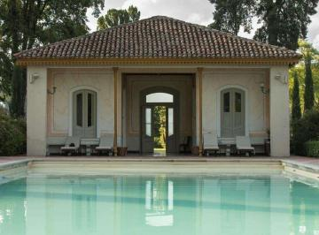

**#10** — **Ascochinga, Córdoba**

- **Precio:** USD 130.000
- **Superficie:** 6,000 m²
- **Precio/m²:** USD 21.67/m²
- Lote 114 Mza 20 Sierras - Estancia La Paz - Ascochinga CórdobaEstancia La Paz - Naturaleza, Historia y Estilo de Vida en
- [Ver publicación](https://www.zonaprop.com.ar/propiedades/clasificado/vecltrin-venta-de-lote-en-estancia-la-paz-ascochinga-58247170.html?n_src=Listado&n_pills=Encargado&n_pg=3&n_pos=25)

---

## Análisis por Zona

| Zona | Cant. | Precio/m² Prom. | Precio/m² Mín. | Precio/m² Máx. | Precio Prom. | Sup. Prom. |
|------|------:|----------------:|---------------:|---------------:|-------------:|-----------:|
| Colonia Caroya | 1 | $3.21 | $3.21 | $3.21 | $170,000 | 53,000 m² |
| Corral de Barranca | 1 | $8.20 | $8.20 | $8.20 | $43,000 | 5,244 m² |
| Barrio de Campo El Sereno | 1 | $10.81 | $10.81 | $10.81 | $20,200 | 1,868 m² |
| La Falda | 1 | $11.03 | $11.03 | $11.03 | $10,700 | 970 m² |
| San Antonio de Arredondo | 1 | $11.71 | $11.71 | $11.71 | $72,000 | 6,150 m² |
| Monte Cristo | 1 | $12.42 | $12.42 | $12.42 | $4,000 | 322 m² |
| Los Cocos | 1 | $12.50 | $12.50 | $12.50 | $25,000 | 2,000 m² |
| Potrero de Garay | 2 | $12.70 | $6.96 | $18.44 | $21,750 | 2,746 m² |
| Estancia Vieja | 1 | $15.15 | $15.15 | $15.15 | $12,000 | 792 m² |
| Ascochinga | 2 | $15.88 | $10.08 | $21.67 | $90,200 | 5,500 m² |
| San Roque | 1 | $16.33 | $16.33 | $16.33 | $245,000 | 15,000 m² |
| Villa Giardino | 1 | $19.20 | $19.20 | $19.20 | $22,000 | 1,146 m² |
| Río Ceballos | 6 | $21.63 | $2.65 | $60.00 | $47,333 | 6,108 m² |
| Alta Gracia | 3 | $24.91 | $12.80 | $44.94 | $41,000 | 2,375 m² |
| Estación del Carmen | 2 | $31.29 | $29.55 | $33.02 | $68,000 | 2,175 m² |
| Santa María de Punilla | 2 | $33.50 | $17.00 | $50.00 | $31,000 | 950 m² |
| Los Molinos | 1 | $38.33 | $38.33 | $38.33 | $110,000 | 2,870 m² |
| Puerto del Águila Country Náutico | 1 | $40.25 | $40.25 | $40.25 | $52,000 | 1,292 m² |
| Villa del Lago | 6 | $42.51 | $28.95 | $74.07 | $46,000 | 1,182 m² |
| Río Segundo | 1 | $45.30 | $45.30 | $45.30 | $54,000 | 1,192 m² |
| Cumbres del Golf | 1 | $45.80 | $45.80 | $45.80 | $48,000 | 1,048 m² |
| Santa María | 2 | $49.34 | $12.02 | $86.67 | $124,500 | 5,700 m² |
| El Talar | 1 | $49.37 | $49.37 | $49.37 | $35,000 | 709 m² |
| Aires del Nordeste | 1 | $50.51 | $50.51 | $50.51 | $25,000 | 495 m² |
| Terrazas de Villa Allende | 1 | $52.78 | $52.78 | $52.78 | $38,000 | 720 m² |
| Colón | 1 | $53.42 | $53.42 | $53.42 | $39,000 | 730 m² |
| Causana | 1 | $56.15 | $56.15 | $56.15 | $120,000 | 2,137 m² |
| La Arbolada | 2 | $56.81 | $48.62 | $65.00 | $67,750 | 1,225 m² |
| Valle del Golf | 3 | $61.89 | $54.00 | $75.00 | $57,333 | 933 m² |
| La Cumbre | 1 | $64.23 | $64.23 | $64.23 | $44,000 | 685 m² |
| Santa Rosa de Calamuchita | 3 | $64.36 | $21.00 | $87.89 | $135,000 | 4,090 m² |
| Mendiolaza | 1 | $65.38 | $65.38 | $65.38 | $85,000 | 1,300 m² |
| Las Corzuelas | 1 | $75.00 | $75.00 | $75.00 | $187,500 | 2,500 m² |
| Unquillo | 1 | $75.00 | $75.00 | $75.00 | $93,750 | 1,250 m² |
| La Deseada Country | 8 | $80.66 | $64.42 | $102.40 | $95,065 | 1,182 m² |
| Villa Allende Golf | 2 | $81.34 | $65.00 | $97.67 | $1,655,000 | 22,631 m² |
| Villa Catalina | 5 | $81.77 | $68.23 | $94.54 | $37,000 | 456 m² |
| Villa Rivera Indarte | 1 | $88.33 | $88.33 | $88.33 | $31,800 | 360 m² |
| La Cercania | 1 | $89.00 | $89.00 | $89.00 | $89,000 | 1,000 m² |
| Quintas de Flores | 1 | $92.76 | $92.76 | $92.76 | $137,000 | 1,477 m² |
| Villa Warcalde | 1 | $96.46 | $96.46 | $96.46 | $300,000 | 3,110 m² |
| Estancia Q2 | 2 | $103.90 | $97.87 | $109.93 | $145,000 | 1,406 m² |
| Villa Esquiú | 1 | $116.67 | $116.67 | $116.67 | $42,000 | 360 m² |
| San Alfonso del Talar | 2 | $118.27 | $111.11 | $125.42 | $72,500 | 614 m² |
| La Cuesta | 1 | $131.19 | $131.19 | $131.19 | $159,000 | 1,212 m² |
| Docta Central | 4 | $136.19 | $124.05 | $146.83 | $34,875 | 256 m² |
| DOCTA | 5 | $137.38 | $43.85 | $198.40 | $39,460 | 277 m² |
| Docta Parque | 2 | $148.61 | $147.22 | $150.00 | $53,500 | 360 m² |
| Campos de Manantiales | 1 | $149.23 | $149.23 | $149.23 | $48,500 | 325 m² |
| Chacras de la Villa | 1 | $149.40 | $149.40 | $149.40 | $149,400 | 1,000 m² |
| Inaudi | 1 | $150.38 | $150.38 | $150.38 | $40,000 | 266 m² |
| Malagueño | 2 | $151.32 | $92.24 | $210.40 | $42,902 | 305 m² |
| Cuestas de Manantiales | 4 | $152.87 | $131.58 | $180.00 | $40,000 | 263 m² |
| Estancia El Terrón | 2 | $155.91 | $138.52 | $173.29 | $255,500 | 1,626 m² |
| Pampas de Manantiales | 2 | $160.19 | $154.67 | $165.71 | $58,000 | 362 m² |
| San Isidro | 1 | $171.43 | $171.43 | $171.43 | $180,000 | 1,050 m² |
| Manantiales | 8 | $173.04 | $149.87 | $212.00 | $51,583 | 299 m² |
| Acquavista | 2 | $177.42 | $123.81 | $231.02 | $67,500 | 414 m² |
| Coronel Olmedo | 1 | $178.47 | $178.47 | $178.47 | $945,000 | 5,295 m² |
| Córdoba | 5 | $178.99 | $62.00 | $347.22 | $69,050 | 423 m² |
| Las Cañitas Barrio Privado | 3 | $180.32 | $160.00 | $216.67 | $73,667 | 420 m² |
| Siete Soles Naturaleza Urbana | 6 | $187.75 | $110.00 | $216.67 | $129,150 | 750 m² |
| San Ignacio Village | 2 | $189.46 | $184.48 | $194.44 | $71,250 | 376 m² |
| Distrito Sur | 1 | $194.44 | $194.44 | $194.44 | $70,000 | 360 m² |
| Nuevo Malagueño | 2 | $207.55 | $207.55 | $207.55 | $55,000 | 265 m² |
| Los Boulevares | 1 | $210.53 | $210.53 | $210.53 | $80,000 | 380 m² |
| Terrazas de Manantiales | 1 | $252.00 | $252.00 | $252.00 | $63,000 | 250 m² |
| Prados de Manantiales | 1 | $261.72 | $261.72 | $261.72 | $67,000 | 256 m² |
| Argüello | 1 | $278.33 | $278.33 | $278.33 | $140,000 | 503 m² |
| Jardín Inglés | 1 | $293.75 | $293.75 | $293.75 | $235,000 | 800 m² |
| La Luisita | 1 | $411.11 | $411.11 | $411.11 | $148,000 | 360 m² |
| Observatorio | 1 | $416.67 | $416.67 | $416.67 | $45,000 | 108 m² |
| Nueva Córdoba | 1 | $472.44 | $472.44 | $472.44 | $300,000 | 635 m² |
| Centro | 1 | $477.11 | $477.11 | $477.11 | $198,000 | 415 m² |
| General Paz | 1 | $1,160.93 | $1,160.93 | $1,160.93 | $472,500 | 407 m² |

---

## Listado Completo

| # | Imagen | Ubicación | Superficie | Precio | Precio/m² | Link |
|--:|--------|-----------|----------:|-------:|----------:|------|
| 1 |  | Río Ceballos, Córdoba | 22,250 m² | USD 59.000 | $2.65 | [Ver](https://www.zonaprop.com.ar/propiedades/clasificado/vecltrin-oportunidad!-vendo-22.250-m-sup2--a-usd-59.000-en-58220070.html?n_src=Listado&n_pg=2&n_pos=11) |
| 2 |  | Colonia Caroya, Córdoba | 53,000 m² | USD 170.000 | $3.21 | [Ver](https://www.zonaprop.com.ar/propiedades/clasificado/vecltrin-venta-campo-de-5-3-ha-ideal-para-producir-56901548.html?n_src=Listado&n_pg=5&n_pos=12) |
| 3 |  | Río Ceballos, Córdoba | 6,560 m² | USD 29.000 | $4.42 | [Ver](https://www.zonaprop.com.ar/propiedades/clasificado/vecltrin-imperdibles!-vendo-lotes-desde-6600-m-sup2--camino-del-58220063.html?n_src=Listado&n_pg=3&n_pos=4) |
| 4 |  | Potrero de Garay, Córdoba | 5,032 m² | USD 35.000 | $6.96 | [Ver](https://www.zonaprop.com.ar/propiedades/clasificado/vecltrin-terreno-en-venta-sierras-de-cordoba-potrero-de-garay-58126335.html?n_src=Listado&n_pills=Terraza&n_pg=3&n_pos=7) |
| 5 |  | Corral de Barranca, Unquillo | 5,244 m² | USD 43.000 | $8.20 | [Ver](https://www.zonaprop.com.ar/propiedades/clasificado/vecltrin-terreno-en-venta-en-corral-de-barranca-57324159.html?n_src=Listado&n_pg=1&n_pos=15) |
| 6 |  | Ascochinga, Córdoba | 5,000 m² | USD 50.400 | $10.08 | [Ver](https://www.zonaprop.com.ar/propiedades/clasificado/vecltrin-terrenos-en-venta-de-5000-m-sup2--en-el-buen-aire-57412066.html?n_src=Listado&n_pills=Encargado&n_pg=3&n_pos=6) |
| 7 |  | Barrio de Campo El Sereno, Villa Yacanto | 1,868 m² | USD 20.200 | $10.81 | [Ver](https://www.zonaprop.com.ar/propiedades/clasificado/vecltrin-terreno-en-venta-barrio-de-campo-el-sereno-yacanto-58413978.html?n_src=Listado&n_pg=3&n_pos=15) |
| 8 |  | La Falda, Córdoba | 970 m² | USD 10.700 | $11.03 | [Ver](https://www.zonaprop.com.ar/propiedades/clasificado/vecltrin-venta-terreno-970-m-sup2--club-de-campo-los-tres-58041333.html?n_src=Listado&n_pg=5&n_pos=10) |
| 9 |  | San Antonio de Arredondo, Córdoba | 6,150 m² | USD 72.000 | $11.71 | [Ver](https://www.zonaprop.com.ar/propiedades/clasificado/vecltrin-terreno-en-san-antonio-de-arredondo-57107854.html?n_src=Listado&n_pg=3&n_pos=18) |
| 10 |  | Santa María, Córdoba | 9,900 m² | USD 119.000 | $12.02 | [Ver](https://www.zonaprop.com.ar/propiedades/clasificado/vecltrin-lote-en-venta-san-clemente-1-ha-oportunidad-57468325.html?n_src=Listado&n_pills=SUM&n_pg=4&n_pos=24) |
| 11 |  | Monte Cristo, Córdoba | 322 m² | USD 4.000 | $12.42 | [Ver](https://www.zonaprop.com.ar/propiedades/clasificado/vecltrin-oportunidad-lotes-la-rochelle-monte-cristo-58412660.html?n_src=Listado&n_pg=2&n_pos=17) |
| 12 |  | Los Cocos, Córdoba | 2,000 m² | USD 25.000 | $12.50 | [Ver](https://www.zonaprop.com.ar/propiedades/clasificado/vecltrin-ultimos-2-lotes-!-los-cocos-b-jardin-financiacion-58220249.html?n_src=Listado&n_pg=5&n_pos=5) |
| 13 |  | Alta Gracia, Córdoba | 2,500 m² | USD 32.000 | $12.80 | [Ver](https://www.zonaprop.com.ar/propiedades/clasificado/vecltrin-venta-de-lote-en-anisacate-con-apto-credito-58030072.html?n_src=Listado&n_pills=Apto+cr%C3%A9dito&n_pg=2&n_pos=13) |
| 14 |  | Estancia Vieja, Córdoba | 792 m² | USD 12.000 | $15.15 | [Ver](https://www.zonaprop.com.ar/propiedades/clasificado/vecltrin-en-venta-lote-estancia-vieja-villa-carlos-paz-49593695.html?n_src=Listado&n_pg=4&n_pos=28) |
| 15 |  | San Roque, Córdoba | 15,000 m² | USD 245.000 | $16.33 | [Ver](https://www.zonaprop.com.ar/propiedades/clasificado/vecltrin-terreno-en-venta-en-san-roque-54534716.html?n_src=Listado&n_pills=SUM&n_pg=3&n_pos=3) |
| 16 | 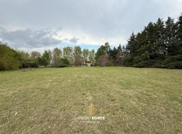 | Alta Gracia, Córdoba | 4,179 m² | USD 70.999 | $16.99 | [Ver](https://www.zonaprop.com.ar/propiedades/clasificado/vecltrin-terreno-en-venta-campos-del-virrey-58369841.html?n_src=Listado&n_pg=3&n_pos=23) |
| 17 |  | Santa María de Punilla, Córdoba | 1,000 m² | USD 17.000 | $17.00 | [Ver](https://www.zonaprop.com.ar/propiedades/clasificado/vecltrin-terreno-en-tanti-lomas-57115202.html?n_src=Listado&n_pg=5&n_pos=13) |
| 18 |  | Río Ceballos, Córdoba | 950 m² | USD 17.000 | $17.89 | [Ver](https://www.zonaprop.com.ar/propiedades/clasificado/vecltrin-terreno-en-venta-en-la-lucinda-rio-ceballos-cno-del-58141289.html?n_src=Listado&n_pg=4&n_pos=23) |
| 19 |  | Potrero de Garay, Córdoba | 461 m² | USD 8.500 | $18.44 | [Ver](https://www.zonaprop.com.ar/propiedades/clasificado/vecltrin-oportunidad-en-potrero-de-garay:-lote-esquina-con-57821917.html?n_src=Listado&n_pg=2&n_pos=7) |
| 20 | 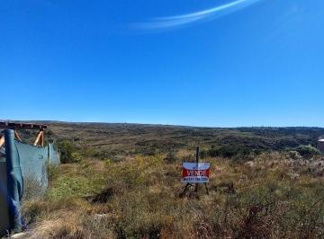 | Villa Giardino, Córdoba | 1,146 m² | USD 22.000 | $19.20 | [Ver](https://www.zonaprop.com.ar/propiedades/clasificado/vecltrin-villa-giardiano-los-quimbaletes-lote-con-vista-58195048.html?n_src=Listado&n_pg=5&n_pos=24) |
| 21 |  | Santa Rosa de Calamuchita, Córdoba | 10,000 m² | USD 210.000 | $21.00 | [Ver](https://www.zonaprop.com.ar/propiedades/clasificado/vecltrin-terreno-en-venta-al-lado-del-rio-calamuchita-58158844.html?n_src=Listado&n_pg=4&n_pos=13) |
| 22 | 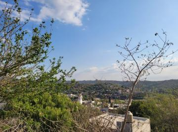 | Río Ceballos, Córdoba | 2,100 m² | USD 45.000 | $21.43 | [Ver](https://www.zonaprop.com.ar/propiedades/clasificado/vecltrin-vendo-lote-2100-m-sup2--inmejorable-vista-barrio-58219493.html?n_src=Listado&n_pg=1&n_pos=22) |
| 23 |  | Ascochinga, Córdoba | 6,000 m² | USD 130.000 | $21.67 | [Ver](https://www.zonaprop.com.ar/propiedades/clasificado/vecltrin-venta-de-lote-en-estancia-la-paz-ascochinga-58247170.html?n_src=Listado&n_pills=Encargado&n_pg=3&n_pos=25) |
| 24 | 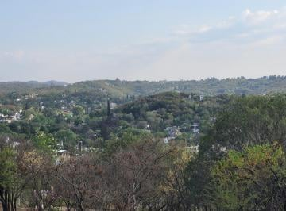 | Río Ceballos, Córdoba | 4,187 m² | USD 98.000 | $23.41 | [Ver](https://www.zonaprop.com.ar/propiedades/clasificado/vecltrin-vendo-terreno-4200-m-sup2--gran-vista-barrio-estancia-53247098.html?n_src=Listado&n_pg=3&n_pos=12) |
| 25 | 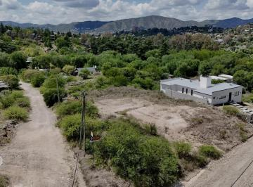 | Villa del Lago, Villa Carlos Paz | 1,727 m² | USD 50.000 | $28.95 | [Ver](https://www.zonaprop.com.ar/propiedades/clasificado/vecltrin-terreno-en-villa-del-lago-57840342.html?n_src=Listado&n_pg=1&n_pos=26) |
| 26 |  | Villa del Lago, Villa Carlos Paz | 1,727 m² | USD 50.000 | $28.95 | [Ver](https://www.zonaprop.com.ar/propiedades/clasificado/vecltrin-terreno-en-villa-del-lago-57840342.html?n_src=Listado&n_pg=3&n_pos=10) |
| 27 | 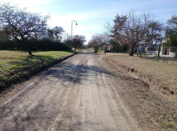 | Estación del Carmen, Malagueño | 2,200 m² | USD 65.000 | $29.55 | [Ver](https://www.zonaprop.com.ar/propiedades/clasificado/vecltrin-lote-en-el-country-estacion-del-carmen-a-la-venta-57523619.html?n_src=Listado&n_pills=Encargado&n_pg=1&n_pos=13) |
| 28 | 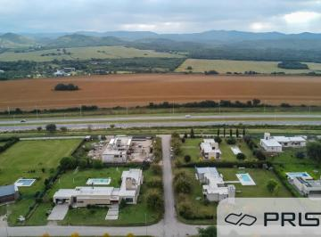 | Estación del Carmen, Malagueño | 2,150 m² | USD 71.000 | $33.02 | [Ver](https://www.zonaprop.com.ar/propiedades/clasificado/vecltrin-lote-4300-m-sup2--estacion-del-carmen-56477849.html?n_src=Listado&n_pg=4&n_pos=21) |
| 29 | 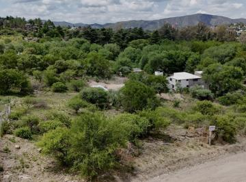 | Villa del Lago, Villa Carlos Paz | 1,046 m² | USD 35.000 | $33.46 | [Ver](https://www.zonaprop.com.ar/propiedades/clasificado/vecltrin-terreno-en-villa-del-lago-57840470.html?n_src=Listado&n_pg=3&n_pos=26) |
| 30 | 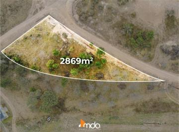 | Los Molinos, Córdoba | 2,870 m² | USD 110.000 | $38.33 | [Ver](https://www.zonaprop.com.ar/propiedades/clasificado/vecltrin-terreno-en-venta-molvento-con-vista-al-dique-los-56877021.html?n_src=Listado&n_pg=4&n_pos=18) |
| 31 | 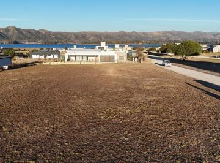 | Puerto del Águila Country Náutico, Los Molino | 1,292 m² | USD 52.000 | $40.25 | [Ver](https://www.zonaprop.com.ar/propiedades/clasificado/vecltrin-terreno-en-venta-en-puerto-del-aguila-country-nautico-56915309.html?n_src=Listado&n_pills=Pileta&n_pg=1&n_pos=7) |
| 32 | 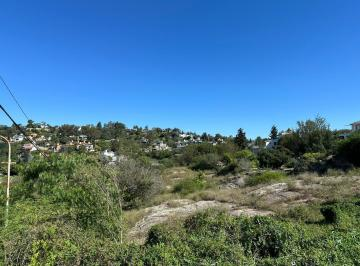 | Villa del Lago, Villa Carlos Paz | 753 m² | USD 31.000 | $41.17 | [Ver](https://www.zonaprop.com.ar/propiedades/clasificado/vecltrin--venta!-lote-en-villa-del-lago-con-escritura!-57180277.html?n_src=Listado&n_pg=1&n_pos=17) |
| 33 |  | DOCTA, Córdoba | 260 m² | USD 11.400 | $43.85 | [Ver](https://www.zonaprop.com.ar/propiedades/clasificado/vecltrin-lote-en-venta-financiado-docta-central-58136582.html?n_src=Listado&n_pg=2&n_pos=30) |
| 34 |  | Alta Gracia, Córdoba | 445 m² | USD 20.000 | $44.94 | [Ver](https://www.zonaprop.com.ar/propiedades/clasificado/vecltrin-terreno-en-venta-alta-gracia-57563510.html?n_src=Listado&n_pg=4&n_pos=3) |
| 35 | 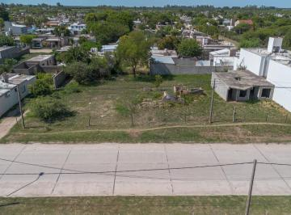 | Río Segundo, Córdoba | 1,192 m² | USD 54.000 | $45.30 | [Ver](https://www.zonaprop.com.ar/propiedades/clasificado/vecltrin-terreno-1200-m-villa-del-rosario-con-construccion-a-57935919.html?n_src=Listado&n_pg=3&n_pos=24) |
| 36 | 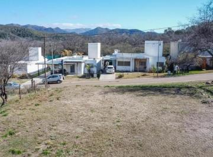 | Cumbres del Golf, Villa Allende | 1,048 m² | USD 48.000 | $45.80 | [Ver](https://www.zonaprop.com.ar/propiedades/clasificado/vecltrin-venta-oportunidad-terreno-central-barrio-cumbres-del-57589180.html?n_src=Listado&n_pills=Apto+cr%C3%A9dito&n_pg=2&n_pos=10) |
| 37 | 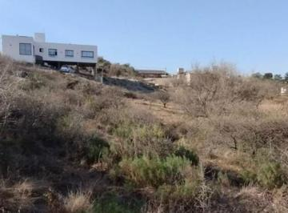 | Villa del Lago, Villa Carlos Paz | 1,032 m² | USD 50.000 | $48.45 | [Ver](https://www.zonaprop.com.ar/propiedades/clasificado/vecltrin-terreno-en-venta-en-villa-del-lago-57524165.html?n_src=Listado&n_pg=4&n_pos=30) |
| 38 |  | La Arbolada, Malagueño | 1,450 m² | USD 70.500 | $48.62 | [Ver](https://www.zonaprop.com.ar/propiedades/clasificado/vecltrin-lote-central-en-venta-arbolada-malagueno-47968031.html?n_src=Listado&n_pills=Pileta&n_pg=3&n_pos=22) |
| 39 | 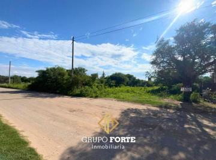 | El Talar, Mendiolaza | 709 m² | USD 35.000 | $49.37 | [Ver](https://www.zonaprop.com.ar/propiedades/clasificado/vecltrin-terreno-en-venta-talar-de-mendiolaza-58128078.html?n_src=Listado&n_pg=4&n_pos=17) |
| 40 | 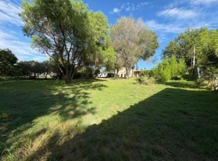 | Santa María de Punilla, Córdoba | 900 m² | USD 45.000 | $50.00 | [Ver](https://www.zonaprop.com.ar/propiedades/clasificado/vecltrin-terreno-en-venta-900-m-sup2--escritura-san-antonio-58212901.html?n_src=Listado&n_pills=SUM&n_pg=5&n_pos=20) |
| 41 | 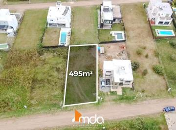 | Aires del Nordeste, Unquillo | 495 m² | USD 25.000 | $50.51 | [Ver](https://www.zonaprop.com.ar/propiedades/clasificado/vecltrin-lote-a-la-venta-barrio-cerrado-en-unquillo-57822126.html?n_src=Listado&n_pg=1&n_pos=6) |
| 42 | 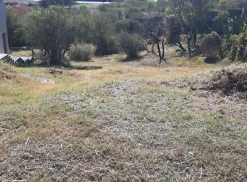 | Terrazas de Villa Allende, Villa Allende | 720 m² | USD 38.000 | $52.78 | [Ver](https://www.zonaprop.com.ar/propiedades/clasificado/vecltrin-gran-oportunidad-financiacion!-vendo-lote-de-720-57142579.html?n_src=Listado&n_pills=Terraza&n_pg=4&n_pos=11) |
| 43 |  | Colón, Córdoba | 730 m² | USD 39.000 | $53.42 | [Ver](https://www.zonaprop.com.ar/propiedades/clasificado/vecltrin-colonia-caroya-urbanizacion-aires-de-caroya-lote-58195059.html?n_src=Listado&n_pills=Apto+cr%C3%A9dito&n_pg=2&n_pos=16) |
| 44 | 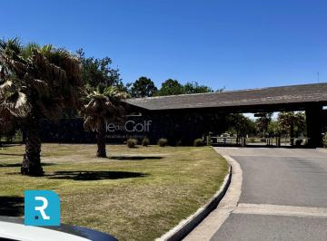 | Valle del Golf, Malagueño | 500 m² | USD 27.000 | $54.00 | [Ver](https://www.zonaprop.com.ar/propiedades/clasificado/vecltrin-terreno-valle-del-golf-todas-las-etapa-58264864.html?n_src=Listado&n_pills=Encargado&n_pg=5&n_pos=9) |
| 45 | 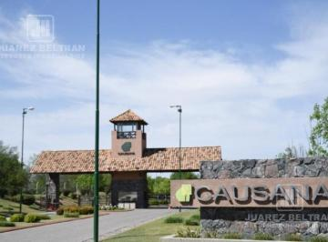 | Causana, Malagueño | 2,137 m² | USD 120.000 | $56.15 | [Ver](https://www.zonaprop.com.ar/propiedades/clasificado/vecltrin-venta-lote-2137-m-sup2--causana-58341834.html?n_src=Listado&n_pills=Encargado&n_pg=5&n_pos=23) |
| 46 | 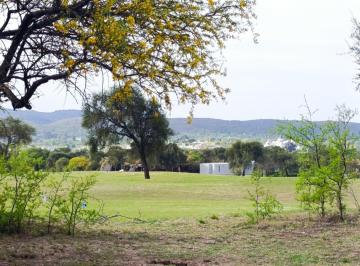 | Valle del Golf, Malagueño | 1,500 m² | USD 85.000 | $56.67 | [Ver](https://www.zonaprop.com.ar/propiedades/clasificado/vecltrin-espectacular-terreno-en-valle-del-golf-malagueno-57281441.html?n_src=Listado&n_pills=Encargado&n_pg=2&n_pos=25) |
| 47 |  | Río Ceballos, Córdoba | 600 m² | USD 36.000 | $60.00 | [Ver](https://www.zonaprop.com.ar/propiedades/clasificado/vecltrin-villa-catalina-lote-de-600-m-c-escritura-58195040.html?n_src=Listado&n_pills=Encargado&n_pg=2&n_pos=22) |
| 48 |  | Córdoba, Córdoba | 250 m² | USD 15.500 | $62.00 | [Ver](https://www.zonaprop.com.ar/propiedades/clasificado/vecltrin-terreno-en-valle-cercano-57948053.html?n_src=Listado&n_pills=Encargado&n_pg=2&n_pos=19) |
| 49 | 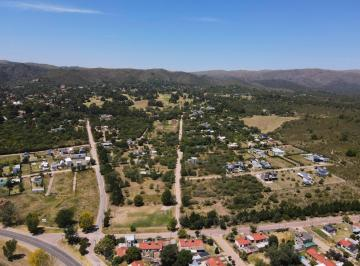 | La Cumbre, Córdoba | 685 m² | USD 44.000 | $64.23 | [Ver](https://www.zonaprop.com.ar/propiedades/clasificado/vecltrin-terreno-en-venta-la-cumbre.-escritura.-55151101.html?n_src=Listado&n_pg=3&n_pos=9) |
| 50 | 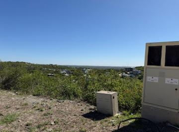 | La Deseada Country, La Calera | 1,397 m² | USD 90.000 | $64.42 | [Ver](https://www.zonaprop.com.ar/propiedades/clasificado/vecltrin--venta!-lote-en-la-deseada-con-escritura!-se-permuta-57702704.html?n_src=Listado&n_pg=4&n_pos=15) |
| 51 |  | Villa Allende Golf, Villa Allende | 34,000 m² | USD 2.210.000 | $65.00 | [Ver](https://www.zonaprop.com.ar/propiedades/clasificado/vecltrin-terreno-en-venta-apto-housing-56234840.html?n_src=Listado&n_pills=Pileta&n_pg=2&n_pos=24) |
| 52 | 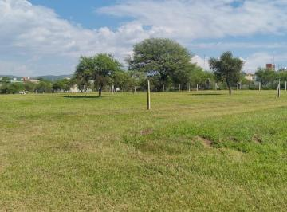 | La Arbolada, Malagueño | 1,000 m² | USD 65.000 | $65.00 | [Ver](https://www.zonaprop.com.ar/propiedades/clasificado/vecltrin-vende-terreno-en-la-arbolada-55852670.html?n_src=Listado&n_pills=Quincho&n_pg=5&n_pos=2) |
| 53 | 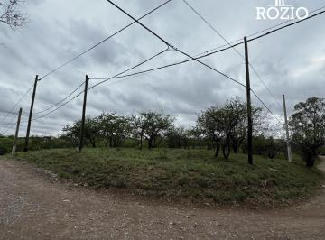 | Mendiolaza, Córdoba | 1,300 m² | USD 85.000 | $65.38 | [Ver](https://www.zonaprop.com.ar/propiedades/clasificado/vecltrin-terrenos-en-venta-en-b-mendiolaza-golf-escritura-58195046.html?n_src=Listado&n_pg=2&n_pos=2) |
| 54 | 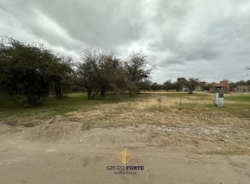 | Villa Catalina, Río Ceballos | 513 m² | USD 35.000 | $68.23 | [Ver](https://www.zonaprop.com.ar/propiedades/clasificado/vecltrin-terren-en-venta-villa-catalina-58019772.html?n_src=Listado&n_pills=Encargado&n_pg=1&n_pos=1) |
| 55 |  | Villa Catalina, Río Ceballos | 513 m² | USD 35.000 | $68.23 | [Ver](https://www.zonaprop.com.ar/propiedades/clasificado/vecltrin-terren-en-venta-villa-catalina-58019772.html?n_src=Listado&n_pills=Encargado&n_pg=5&n_pos=19) |
| 56 |  | Córdoba, Córdoba | 783 m² | USD 54.000 | $68.97 | [Ver](https://www.zonaprop.com.ar/propiedades/clasificado/vecltrin-venta-terreno-783-m-apto-duplex-paseo-rivera-56866307.html?n_src=Listado&n_pg=5&n_pos=7) |
| 57 |  | La Deseada Country, La Calera | 1,051 m² | USD 72.620 | $69.10 | [Ver](https://www.zonaprop.com.ar/propiedades/clasificado/vecltrin--venta!-lote-en-vistas-de-la-deseada-vistas-1-57247606.html?n_src=Listado&n_pg=1&n_pos=23) |
| 58 |  | La Deseada Country, La Calera | 1,230 m² | USD 90.000 | $73.17 | [Ver](https://www.zonaprop.com.ar/propiedades/clasificado/vecltrin-oportunidad!-lotes-en-venta-country-la-deseada-57237243.html?n_src=Listado&n_pills=Encargado&n_pg=4&n_pos=25) |
| 59 |  | Villa del Lago, Villa Carlos Paz | 810 m² | USD 60.000 | $74.07 | [Ver](https://www.zonaprop.com.ar/propiedades/clasificado/vecltrin-terreno-en-villa-del-lago-57108418.html?n_src=Listado&n_pg=2&n_pos=18) |
| 60 |  | Las Corzuelas, Unquillo | 2,500 m² | USD 187.500 | $75.00 | [Ver](https://www.zonaprop.com.ar/propiedades/clasificado/vecltrin-terreno-en-unquillo-parque-logistico-e-industrial-56619639.html?n_src=Listado&n_pg=3&n_pos=8) |
| 61 |  | Unquillo, Córdoba | 1,250 m² | USD 93.750 | $75.00 | [Ver](https://www.zonaprop.com.ar/propiedades/clasificado/vecltrin-terreno-en-unquillo-parque-logistico-e-industrial-55982855.html?n_src=Listado&n_pg=4&n_pos=22) |
| 62 |  | Valle del Golf, Malagueño | 800 m² | USD 60.000 | $75.00 | [Ver](https://www.zonaprop.com.ar/propiedades/clasificado/vecltrin--venta!-lote-en-barrio-privado-valle-del-golf-lote-57136782.html?n_src=Listado&n_pg=5&n_pos=30) |
| 63 |  | La Deseada Country, La Calera | 1,065 m² | USD 79.900 | $75.02 | [Ver](https://www.zonaprop.com.ar/propiedades/clasificado/vecltrin-terreno-en-venta-en-country-la-deseada-56714233.html?n_src=Listado&n_pills=Encargado&n_pg=2&n_pos=4) |
| 64 |  | La Deseada Country, La Calera | 1,250 m² | USD 100.000 | $80.00 | [Ver](https://www.zonaprop.com.ar/propiedades/clasificado/vecltrin-country-la-deseada-lote-1250-m-sup2--a-m-boulevard-47846492.html?n_src=Listado&n_pills=Encargado&n_pg=4&n_pos=20) |
| 65 |  | Villa Catalina, Río Ceballos | 300 m² | USD 25.000 | $83.33 | [Ver](https://www.zonaprop.com.ar/propiedades/clasificado/vecltrin-terreno-en-villa-catalina-campos-verdes-escritura-58195042.html?n_src=Listado&n_pills=SUM&n_pg=5&n_pos=25) |
| 66 |  | Santa Rosa de Calamuchita, Córdoba | 1,247 m² | USD 105.000 | $84.20 | [Ver](https://www.zonaprop.com.ar/propiedades/clasificado/vecltrin-molvento-lote-en-venta-58317177.html?n_src=Listado&n_pg=1&n_pos=19) |
| 67 |  | La Deseada Country, La Calera | 1,179 m² | USD 100.000 | $84.82 | [Ver](https://www.zonaprop.com.ar/propiedades/clasificado/vecltrin-se-vende-lote-1179-m-sup2--coutry-la-deseada-57237300.html?n_src=Listado&n_pills=Encargado&n_pg=4&n_pos=2) |
| 68 |  | Santa María, Córdoba | 1,500 m² | USD 130.000 | $86.67 | [Ver](https://www.zonaprop.com.ar/propiedades/clasificado/vecltrin-lote-en-venta-valle-del-golf-55499991.html?n_src=Listado&n_pills=SUM&n_pg=1&n_pos=16) |
| 69 |  | Santa Rosa de Calamuchita, Córdoba | 1,024 m² | USD 90.000 | $87.89 | [Ver](https://www.zonaprop.com.ar/propiedades/clasificado/vecltrin-punta-penon-lote-en-venta-58317101.html?n_src=Listado&n_pg=5&n_pos=27) |
| 70 |  | Villa Rivera Indarte, Córdoba | 360 m² | USD 31.800 | $88.33 | [Ver](https://www.zonaprop.com.ar/propiedades/clasificado/vecltrin-terreno-en-villa-rivera-indarte-58217391.html?n_src=Listado&n_pg=3&n_pos=19) |
| 71 |  | La Cercania, Mendiolaza | 1,000 m² | USD 89.000 | $89.00 | [Ver](https://www.zonaprop.com.ar/propiedades/clasificado/vecltrin-terreno-en-la-cercania-1000-m-mendiolaza-sobre-e53-57915003.html?n_src=Listado&n_pills=Encargado&n_pg=5&n_pos=4) |
| 72 |  | Tejas 4, Malagueño | 350 m² | $ 32.000 | $91.43 | [Ver](https://www.zonaprop.com.ar/propiedades/clasificado/vecltrin-oportunidad-lote-en-venta-en-tejas-4-etapa-1-zona-57805410.html?n_src=Listado&n_pg=1&n_pos=29) |
| 73 |  | Malagueño, Córdoba | 360 m² | USD 33.205 | $92.24 | [Ver](https://www.zonaprop.com.ar/propiedades/clasificado/vecltrin-veneto-country-lotes-residencial-entrega-y-57727425.html?n_src=Listado&n_pills=Encargado&n_pg=1&n_pos=27) |
| 74 |  | Quintas de Flores, Córdoba | 1,477 m² | USD 137.000 | $92.76 | [Ver](https://www.zonaprop.com.ar/propiedades/clasificado/vecltrin-terreno-de-1.477-m-sup2--quintas-de-flores-57936311.html?n_src=Listado&n_pg=4&n_pos=1) |
| 75 |  | Villa Catalina, Río Ceballos | 476 m² | USD 45.000 | $94.54 | [Ver](https://www.zonaprop.com.ar/propiedades/clasificado/vecltrin-terreno-en-venta-en-villa-catalina-escritura-listo-58098495.html?n_src=Listado&n_pills=Apto+cr%C3%A9dito&n_pg=1&n_pos=11) |
| 76 |  | Villa Catalina, Río Ceballos | 476 m² | USD 45.000 | $94.54 | [Ver](https://www.zonaprop.com.ar/propiedades/clasificado/vecltrin-terreno-en-venta-en-villa-catalina-escritura-listo-58098495.html?n_src=Listado&n_pills=Encargado&n_pg=5&n_pos=1) |
| 77 |  | La Deseada Country, La Calera | 1,038 m² | USD 100.000 | $96.34 | [Ver](https://www.zonaprop.com.ar/propiedades/clasificado/vecltrin-lote-terreno-en-venta-de-1.038-m-sup2--country-la-57900060.html?n_src=Listado&n_pills=Encargado&n_pg=3&n_pos=5) |
| 78 |  | Villa Warcalde, Córdoba | 3,110 m² | USD 300.000 | $96.46 | [Ver](https://www.zonaprop.com.ar/propiedades/clasificado/vecltrin-villa-warcalde-venta-lote-terreno-3110-m-sup2--apto-54813470.html?n_src=Listado&n_pg=1&n_pos=21) |
| 79 |  | Villa Allende Golf, Villa Allende | 11,262 m² | USD 1.100.000 | $97.67 | [Ver](https://www.zonaprop.com.ar/propiedades/clasificado/vecltrin-terreno-en-venta-para-housing-en-villa-allende-golf-54179482.html?n_src=Listado&n_pills=Apto+cr%C3%A9dito&n_pg=2&n_pos=6) |
| 80 |  | Estancia Q2, Mendiolaza | 1,594 m² | USD 156.000 | $97.87 | [Ver](https://www.zonaprop.com.ar/propiedades/clasificado/vecltrin-maxima-privacidad-imponente-lote-de-1.594-m-sup2--en-51555095.html?n_src=Listado&n_pills=Pileta&n_pg=4&n_pos=4) |
| 81 |  | La Deseada Country, La Calera | 1,250 m² | USD 128.000 | $102.40 | [Ver](https://www.zonaprop.com.ar/propiedades/clasificado/vecltrin-1375-m-sup2--espectacular-ubicacion!-terreno-en-la-52379311.html?n_src=Listado&n_pills=Encargado&n_pg=5&n_pos=15) |
| 82 |  | Estancia Q2, Mendiolaza | 1,219 m² | USD 134.000 | $109.93 | [Ver](https://www.zonaprop.com.ar/propiedades/clasificado/vecltrin-lote-premium-en-q2-1.219-m-sup2--ubicacion-51659347.html?n_src=Listado&n_pills=Encargado&n_pg=4&n_pos=14) |
| 83 |  | Siete Soles Naturaleza Urbana, Córdoba | 1,500 m² | USD 165.000 | $110.00 | [Ver](https://www.zonaprop.com.ar/propiedades/clasificado/vecltrin-lote-en-venta-1500-m-sup2--heredades-siete-soles-58377274.html?n_src=Listado&n_pills=Terraza&n_pg=2&n_pos=14) |
| 84 |  | San Alfonso del Talar, Mendiolaza | 630 m² | USD 70.000 | $111.11 | [Ver](https://www.zonaprop.com.ar/propiedades/clasificado/vecltrin--venta!-lote-en-san-alfonso-del-talar!-con-56084725.html?n_src=Listado&n_pg=4&n_pos=26) |
| 85 |  | Villa Esquiú, Córdoba | 360 m² | USD 42.000 | $116.67 | [Ver](https://www.zonaprop.com.ar/propiedades/clasificado/vecltrin-lote-en-villa-esquiu-barrio-privado-360-m-sup2--apto-58368877.html?n_src=Listado&n_pills=Encargado&n_pg=1&n_pos=18) |
| 86 |  | Acquavista, Malagueño | 525 m² | USD 65.000 | $123.81 | [Ver](https://www.zonaprop.com.ar/propiedades/clasificado/vecltrin-aquavista-malagueno-terreno-en-venta-proximo-a-la-56477961.html?n_src=Listado&n_pills=Encargado&n_pg=5&n_pos=18) |
| 87 |  | Docta Central, DOCTA | 262 m² | USD 32.500 | $124.05 | [Ver](https://www.zonaprop.com.ar/propiedades/clasificado/vecltrin-lote-262.5-m-sup2--docta-central-etapa-1-58276783.html?n_src=Listado&n_pg=1&n_pos=25) |
| 88 |  | San Alfonso del Talar, Mendiolaza | 598 m² | USD 75.000 | $125.42 | [Ver](https://www.zonaprop.com.ar/propiedades/clasificado/vecltrin--venta!-lotes-en-san-alfonso-del-talar-todos-con-58143566.html?n_src=Listado&n_pg=4&n_pos=27) |
| 89 |  | Docta Central, DOCTA | 262 m² | USD 33.500 | $127.86 | [Ver](https://www.zonaprop.com.ar/propiedades/clasificado/vecltrin-terreno-en-venta-de-262-m-sup2--con-seguridad-24-hs-en-58384109.html?n_src=Listado&n_pg=4&n_pos=29) |
| 90 |  | La Cuesta, Villa Carlos Paz | 1,212 m² | USD 159.000 | $131.19 | [Ver](https://www.zonaprop.com.ar/propiedades/clasificado/vecltrin-terreno-en-venta-en-villa-carlos-paz-54503261.html?n_src=Listado&n_pg=5&n_pos=22) |
| 91 |  | Cuestas de Manantiales, Córdoba | 266 m² | USD 35.000 | $131.58 | [Ver](https://www.zonaprop.com.ar/propiedades/clasificado/vecltrin-lote-266-m-sup2--cuestas-de-manantiales-57898267.html?n_src=Listado&n_pg=2&n_pos=27) |
| 92 |  | Cuestas de Manantiales, Córdoba | 287 m² | USD 39.000 | $135.89 | [Ver](https://www.zonaprop.com.ar/propiedades/clasificado/vecltrin-terreno-residencial-cuestas-de-manantiales-58111082.html?n_src=Listado&n_pg=5&n_pos=28) |
| 93 |  | DOCTA, Córdoba | 250 m² | USD 34.500 | $138.00 | [Ver](https://www.zonaprop.com.ar/propiedades/clasificado/vecltrin-terreno-en-venta-docta-central-58436327.html?n_src=Listado&n_pg=4&n_pos=6) |
| 94 |  | Estancia El Terrón, Mendiolaza | 1,516 m² | USD 210.000 | $138.52 | [Ver](https://www.zonaprop.com.ar/propiedades/clasificado/vecltrin-lote-en-estancia-el-terron-58400942.html?n_src=Listado&n_pg=2&n_pos=28) |
| 95 |  | DOCTA, Córdoba | 250 m² | USD 35.000 | $140.00 | [Ver](https://www.zonaprop.com.ar/propiedades/clasificado/vecltrin-excelente-lote-en-docta-central-entrega-en-diciembre-56654668.html?n_src=Listado&n_pills=Encargado&n_pg=2&n_pos=3) |
| 96 |  | Docta Central, DOCTA | 250 m² | USD 36.500 | $146.00 | [Ver](https://www.zonaprop.com.ar/propiedades/clasificado/vecltrin-dos-lotes-contiguos-en-venta-docta-central-appto.-58010542.html?n_src=Listado&n_pills=Encargado&n_pg=5&n_pos=6) |
| 97 |  | Docta Central, DOCTA | 252 m² | USD 37.000 | $146.83 | [Ver](https://www.zonaprop.com.ar/propiedades/clasificado/vecltrin-lote-252-m-sup2--docta-central-malagueno-58223706.html?n_src=Listado&n_pills=Encargado&n_pg=2&n_pos=12) |
| 98 |  | Docta Parque, DOCTA | 360 m² | USD 53.000 | $147.22 | [Ver](https://www.zonaprop.com.ar/propiedades/clasificado/vecltrin-lote-apto-duplex-docta-parque-consultar-por-otras-57589512.html?n_src=Listado&n_pills=Encargado&n_pg=3&n_pos=30) |
| 99 |  | Campos de Manantiales, Córdoba | 325 m² | USD 48.500 | $149.23 | [Ver](https://www.zonaprop.com.ar/propiedades/clasificado/vecltrin-terreno-en-venta-campos-de-manantiales-excelente-56594897.html?n_src=Listado&n_pg=5&n_pos=26) |
| 100 |  | Chacras de la Villa, Villa Allende | 1,000 m² | USD 149.400 | $149.40 | [Ver](https://www.zonaprop.com.ar/propiedades/clasificado/vecltrin-lotes-a-la-venta-en-chacras-de-la-villa-57868107.html?n_src=Listado&n_pills=Encargado&n_pg=2&n_pos=9) |
| 101 |  | Manantiales, Córdoba | 387 m² | USD 58.000 | $149.87 | [Ver](https://www.zonaprop.com.ar/propiedades/clasificado/vecltrin-lote-en-venta-en-barrio-pampas-de-manantiales.-57108269.html?n_src=Listado&n_pills=Encargado&n_pg=3&n_pos=27) |
| 102 |  | Docta Parque, DOCTA | 360 m² | USD 54.000 | $150.00 | [Ver](https://www.zonaprop.com.ar/propiedades/clasificado/vecltrin-lote-docta-parque-apto-duplex-57957611.html?n_src=Listado&n_pg=4&n_pos=12) |
| 103 |  | Inaudi, Córdoba | 266 m² | USD 40.000 | $150.38 | [Ver](https://www.zonaprop.com.ar/propiedades/clasificado/vecltrin-terreno-en-venta-en-inaudi-lomas-de-valparaiso-57390845.html?n_src=Listado&n_pg=3&n_pos=2) |
| 104 |  | Pampas de Manantiales, Córdoba | 375 m² | USD 58.000 | $154.67 | [Ver](https://www.zonaprop.com.ar/propiedades/clasificado/vecltrin-lote-en-venta-en-pampas-de-manantiales-mananatiales-2-57688440.html?n_src=Listado&n_pg=2&n_pos=26) |
| 105 |  | Manantiales, Córdoba | 250 m² | USD 39.500 | $158.00 | [Ver](https://www.zonaprop.com.ar/propiedades/clasificado/vecltrin-lote-en-venta-250-m-sup2--cuestas-de-manantiales-57564796.html?n_src=Listado&n_pills=Encargado&n_pg=5&n_pos=21) |
| 106 |  | Manantiales, Córdoba | 272 m² | USD 43.500 | $159.93 | [Ver](https://www.zonaprop.com.ar/propiedades/clasificado/vecltrin-lotes-270-m-sup2--abras-de-manantiales-58155278.html?n_src=Listado&n_pg=4&n_pos=10) |
| 107 |  | Las Cañitas Barrio Privado, Malagueño | 400 m² | USD 64.000 | $160.00 | [Ver](https://www.zonaprop.com.ar/propiedades/clasificado/vecltrin-terreno-en-venta-en-las-canitas-barrio-privado-listo-58075637.html?n_src=Listado&n_pills=SUM&n_pg=5&n_pos=14) |
| 108 |  | Manantiales, Córdoba | 350 m² | USD 56.500 | $161.43 | [Ver](https://www.zonaprop.com.ar/propiedades/clasificado/vecltrin-lote-apto-duplex-fondo-norte-350-m-sup2--pampas-de-58155181.html?n_src=Listado&n_pg=1&n_pos=30) |
| 109 |  | Cuestas de Manantiales, Córdoba | 250 m² | USD 41.000 | $164.00 | [Ver](https://www.zonaprop.com.ar/propiedades/clasificado/vecltrin-lote-en-venta-de-250-m-sup2--cuestas-de-manantiales-58143923.html?n_src=Listado&n_pills=Encargado&n_pg=2&n_pos=29) |
| 110 |  | Las Cañitas Barrio Privado, Malagueño | 560 m² | USD 92.000 | $164.29 | [Ver](https://www.zonaprop.com.ar/propiedades/clasificado/vecltrin-terrenoterreno-en-venta-en-malagueno-listo-para-58075680.html?n_src=Listado&n_pills=SUM&n_pg=5&n_pos=11) |
| 111 |  | Pampas de Manantiales, Córdoba | 350 m² | USD 58.000 | $165.71 | [Ver](https://www.zonaprop.com.ar/propiedades/clasificado/vecltrin-hermoso-lote-frente-a-la-plaza-en-pampas-de-57147638.html?n_src=Listado&n_pills=Encargado&n_pg=5&n_pos=16) |
| 112 |  | DOCTA, Córdoba | 252 m² | USD 42.000 | $166.67 | [Ver](https://www.zonaprop.com.ar/propiedades/clasificado/vecltrin-docta-central-manzana-79-lote-5-apto-duplex-58384073.html?n_src=Listado&n_pg=4&n_pos=8) |
| 113 |  | San Isidro, Villa Allende | 1,050 m² | USD 180.000 | $171.43 | [Ver](https://www.zonaprop.com.ar/propiedades/clasificado/vecltrin-terreno-1050-m-sup2--san-isidro-57883474.html?n_src=Listado&n_pills=Encargado&n_pg=2&n_pos=8) |
| 114 |  | Manantiales, Córdoba | 261 m² | USD 45.000 | $172.41 | [Ver](https://www.zonaprop.com.ar/propiedades/clasificado/vecltrin-lote-abras-de-manantiales-residencial-57641310.html?n_src=Listado&n_pills=Terraza&n_pg=1&n_pos=2) |
| 115 |  | Manantiales, Córdoba | 261 m² | USD 45.000 | $172.41 | [Ver](https://www.zonaprop.com.ar/propiedades/clasificado/vecltrin-lote-abras-de-manantiales-residencial-57641310.html?n_src=Listado&n_pills=Terraza&n_pg=2&n_pos=15) |
| 116 |  | Estancia El Terrón, Mendiolaza | 1,737 m² | USD 301.000 | $173.29 | [Ver](https://www.zonaprop.com.ar/propiedades/clasificado/vecltrin-lote-en-estancia-el-terron-con-fondo-golf-51458680.html?n_src=Listado&n_pills=SUM&n_pg=3&n_pos=29) |
| 117 |  | Coronel Olmedo, Córdoba | 5,295 m² | USD 945.000 | $178.47 | [Ver](https://www.zonaprop.com.ar/propiedades/clasificado/vecltrin-lote-5000-m-en-parque-industrial-cacec-camino-a-60-58434417.html?n_src=Listado&n_pills=Encargado&n_pg=3&n_pos=21) |
| 118 |  | Córdoba, Córdoba | 364 m² | USD 65.000 | $178.57 | [Ver](https://www.zonaprop.com.ar/propiedades/clasificado/vecltrin-venta.-prados-de-manantiales.-lote-364-m-sup2-.-14-m-55285079.html?n_src=Listado&n_pills=Encargado&n_pg=2&n_pos=23) |
| 119 |  | Cuestas de Manantiales, Córdoba | 250 m² | USD 45.000 | $180.00 | [Ver](https://www.zonaprop.com.ar/propiedades/clasificado/vecltrin-lote-en-venta-cuestas-de-manantiales-57822277.html?n_src=Listado&n_pg=1&n_pos=9) |
| 120 |  | Siete Soles Naturaleza Urbana, Córdoba | 600 m² | USD 110.000 | $183.33 | [Ver](https://www.zonaprop.com.ar/propiedades/clasificado/vecltrin-lote-en-venta-siete-soles-alqarias-52320025.html?n_src=Listado&n_pills=Terraza&n_pg=5&n_pos=29) |
| 121 |  | San Ignacio Village, Córdoba | 393 m² | USD 72.500 | $184.48 | [Ver](https://www.zonaprop.com.ar/propiedades/clasificado/vecltrin-oportunidad-manantiales-ii-393-m-sup2-!-terreno-52553728.html?n_src=Listado&n_pills=Encargado&n_pg=4&n_pos=5) |
| 122 |  | Siete Soles Naturaleza Urbana, Córdoba | 600 m² | USD 115.000 | $191.67 | [Ver](https://www.zonaprop.com.ar/propiedades/clasificado/vecltrin-terreno-en-venta-de-600-m-en-alqarias-siete-soles-57920776.html?n_src=Listado&n_pills=SUM&n_pg=4&n_pos=9) |
| 123 |  | Distrito Sur, Córdoba | 360 m² | USD 70.000 | $194.44 | [Ver](https://www.zonaprop.com.ar/propiedades/clasificado/vecltrin-lote-oportunidad-en-distrito-sur-apto-residencial-57535878.html?n_src=Listado&n_pills=Encargado&n_pg=3&n_pos=1) |
| 124 |  | San Ignacio Village, Córdoba | 360 m² | USD 70.000 | $194.44 | [Ver](https://www.zonaprop.com.ar/propiedades/clasificado/vecltrin-lotes-en-venta-en-san-ignacio-village-manantiales-55648298.html?n_src=Listado&n_pills=Encargado&n_pg=3&n_pos=20) |
| 125 |  | Manantiales, Córdoba | 364 m² | USD 72.167 | $198.26 | [Ver](https://www.zonaprop.com.ar/propiedades/clasificado/vecltrin-lotes-de-361-m-sup2--en-venta-en-san-ignacio-village-56185421.html?n_src=Listado&n_pg=3&n_pos=13) |
| 126 |  | DOCTA, Córdoba | 375 m² | USD 74.400 | $198.40 | [Ver](https://www.zonaprop.com.ar/propiedades/clasificado/vecltrin-lotes-en-venta-senda-57821499.html?n_src=Listado&n_pills=Encargado&n_pg=2&n_pos=20) |
| 127 |  | Nuevo Malagueño, Malagueño | 265 m² | USD 55.000 | $207.55 | [Ver](https://www.zonaprop.com.ar/propiedades/clasificado/vecltrin-terreno-en-venta-en-nuevo-malagueno-de-265-m-sup2-58161646.html?n_src=Listado&n_pills=Encargado&n_pg=1&n_pos=20) |
| 128 |  | Nuevo Malagueño, Malagueño | 265 m² | USD 55.000 | $207.55 | [Ver](https://www.zonaprop.com.ar/propiedades/clasificado/vecltrin-terreno-en-venta-en-nuevo-malagueno-de-265-m-sup2-58161646.html?n_src=Listado&n_pills=Encargado&n_pg=3&n_pos=17) |
| 129 |  | Siete Soles Naturaleza Urbana, Córdoba | 600 m² | USD 125.000 | $208.33 | [Ver](https://www.zonaprop.com.ar/propiedades/clasificado/vecltrin-terreno-siete-soles-55178015.html?n_src=Listado&n_pg=3&n_pos=28) |
| 130 |  | Malagueño, Malagueño | 250 m² | USD 52.600 | $210.40 | [Ver](https://www.zonaprop.com.ar/propiedades/clasificado/vecltrin-lote-en-venta-en-barrio-nuevo-malagueno-57565257.html?n_src=Listado&n_pg=3&n_pos=14) |
| 131 |  | Los Boulevares, Córdoba | 380 m² | USD 80.000 | $210.53 | [Ver](https://www.zonaprop.com.ar/propiedades/clasificado/vecltrin-lote-apto-duplex-barrio-cerrado-57821915.html?n_src=Listado&n_pg=4&n_pos=7) |
| 132 |  | Manantiales, Córdoba | 250 m² | USD 53.000 | $212.00 | [Ver](https://www.zonaprop.com.ar/propiedades/clasificado/vecltrin-lote-abras-de-manantiales-residencial-57072896.html?n_src=Listado&n_pills=Encargado&n_pg=2&n_pos=5) |
| 133 |  | Siete Soles Naturaleza Urbana, Córdoba | 600 m² | USD 129.900 | $216.50 | [Ver](https://www.zonaprop.com.ar/propiedades/clasificado/vecltrin-venta-terrenos-siete-soles-alcarias-56929370.html?n_src=Listado&n_pills=Parrilla&n_pg=5&n_pos=17) |
| 134 |  | Siete Soles Naturaleza Urbana, Córdoba | 600 m² | USD 130.000 | $216.67 | [Ver](https://www.zonaprop.com.ar/propiedades/clasificado/vecltrin-terreno-siete-soles-57986676.html?n_src=Listado&n_pills=SUM&n_pg=2&n_pos=1) |
| 135 |  | Las Cañitas Barrio Privado, Malagueño | 300 m² | USD 65.000 | $216.67 | [Ver](https://www.zonaprop.com.ar/propiedades/clasificado/vecltrin-terreno-en-venta-en-malagueno-listo-para-construir-58075628.html?n_src=Listado&n_pills=SUM&n_pg=3&n_pos=16) |
| 136 |  | Acquavista, Malagueño | 303 m² | USD 70.000 | $231.02 | [Ver](https://www.zonaprop.com.ar/propiedades/clasificado/vecltrin-lote-en-venta-303-mtrs.2-apto-duplex-acquavista-58292918.html?n_src=Listado&n_pg=2&n_pos=21) |
| 137 |  | Córdoba, Córdoba | 360 m² | USD 85.750 | $238.19 | [Ver](https://www.zonaprop.com.ar/propiedades/clasificado/vecltrin-lotes-en-venta-en-distrito-sur-en-etapa-2-58115474.html?n_src=Listado&n_pills=Encargado&n_pg=4&n_pos=19) |
| 138 |  | Terrazas de Manantiales, Córdoba | 250 m² | USD 63.000 | $252.00 | [Ver](https://www.zonaprop.com.ar/propiedades/clasificado/vecltrin-terreno-en-venta-en-terrazas-de-manantiales!-frente-a-58313820.html?n_src=Listado&n_pills=Terraza&n_pg=1&n_pos=10) |
| 139 |  | Prados de Manantiales, Córdoba | 256 m² | USD 67.000 | $261.72 | [Ver](https://www.zonaprop.com.ar/propiedades/clasificado/vecltrin-lotes-en-venta-en-prados-de-manantiales-58140611.html?n_src=Listado&n_pills=Encargado&n_pg=1&n_pos=3) |
| 140 |  | Argüello, Córdoba | 503 m² | USD 140.000 | $278.33 | [Ver](https://www.zonaprop.com.ar/propiedades/clasificado/vecltrin-at!-terreno-frente-ex-academia-arguello!-entre-rafael-56587577.html?n_src=Listado&n_pills=Apto+cr%C3%A9dito&n_pg=3&n_pos=11) |
| 141 |  | Jardín Inglés, Valle Escondido | 800 m² | USD 235.000 | $293.75 | [Ver](https://www.zonaprop.com.ar/propiedades/clasificado/vecltrin-valle-escondido-lote-en-venta-en-jardin-ingles.-57821507.html?n_src=Listado&n_pills=Encargado&n_pg=5&n_pos=3) |
| 142 |  | Córdoba, Córdoba | 360 m² | USD 125.000 | $347.22 | [Ver](https://www.zonaprop.com.ar/propiedades/clasificado/vecltrin-lote-en-venta-en-chacras-del-sur-ultimo-disponible-57934936.html?n_src=Listado&n_pills=Encargado&n_pg=1&n_pos=28) |
| 143 |  | La Luisita, Córdoba | 360 m² | USD 148.000 | $411.11 | [Ver](https://www.zonaprop.com.ar/propiedades/clasificado/vecltrin-terreno-en-la-luisita-360-m-sup2--apto-duplex.-55824406.html?n_src=Listado&n_pills=Encargado&n_pg=1&n_pos=5) |
| 144 |  | Observatorio, Córdoba | 108 m² | USD 45.000 | $416.67 | [Ver](https://www.zonaprop.com.ar/propiedades/clasificado/vecltrin-terreno-en-venta-b-observatorio-58162354.html?n_src=Listado&n_pg=5&n_pos=8) |
| 145 |  | Nueva Córdoba, Córdoba | 635 m² | USD 300.000 | $472.44 | [Ver](https://www.zonaprop.com.ar/propiedades/clasificado/vecltrin-terreno-en-nueva-cordoba-55276770.html?n_src=Listado&n_pg=1&n_pos=14) |
| 146 |  | Centro, Córdoba | 415 m² | USD 198.000 | $477.11 | [Ver](https://www.zonaprop.com.ar/propiedades/clasificado/vecltrin-casa-terreno-apto-edificio-b-centro-58195067.html?n_src=Listado&n_pg=1&n_pos=24) |
| 147 |  | General Paz, Córdoba | 407 m² | USD 472.500 | $1,160.93 | [Ver](https://www.zonaprop.com.ar/propiedades/clasificado/vecltrin-terreno-en-general-paz-58330227.html?n_src=Listado&n_pg=4&n_pos=16) |

---

*Reporte generado automáticamente. Precios y disponibilidad sujetos a cambios. Consultar en [ZonaProp](https://www.zonaprop.com.ar) para información actualizada.*
